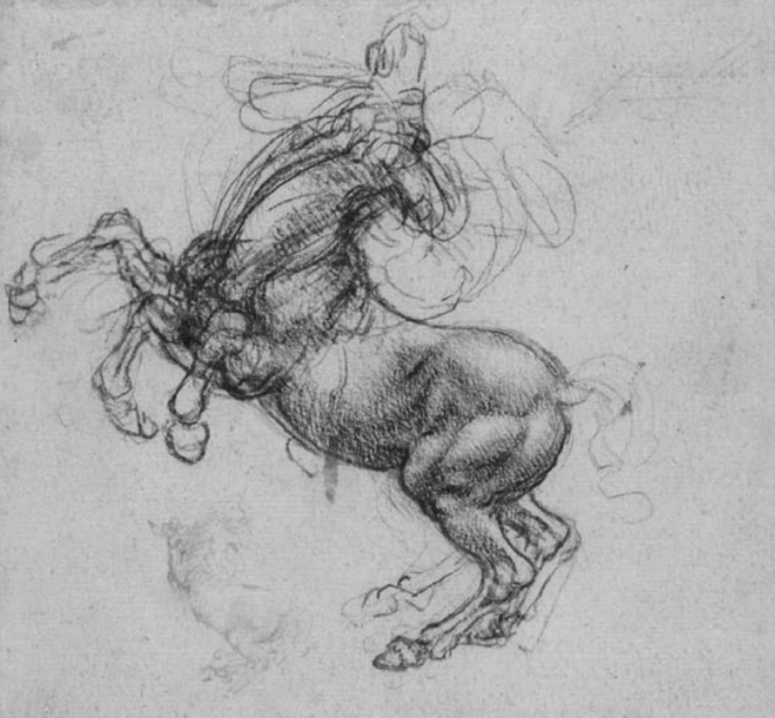
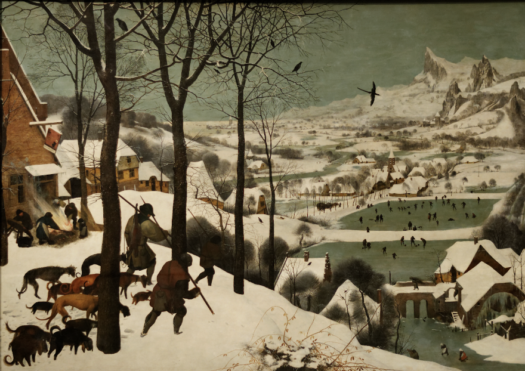

Chapitre 9

> Les objections esthétiques de Copernic à \[équants\] ont fourni un
> motif essentiel pour son rejet du système ptolémaïque…

Thomas Kuhn, La Révolution Copernicienne

> Nous avions tous été entraînés par Kelly Johnson et étions fanatiques
> dans son insistance sur le fait qu’un avion qui avait l’air beau
> volerait de la même manière.

Ben Rich, Skunk Works

> La beauté est le premier test : il n’y a pas de place permanente dans
> ce monde pour les mathématiques laides.

G. H. Hardy, A Mathematician’s Apology

Je parlais récemment à un ami qui enseigne au MIT. Son domaine est en
plein essor maintenant et, chaque année, il est inondé de candidatures
d’étudiants potentiels aux cycles supérieurs. « Beaucoup d’entre eux
semblent intelligents », a-t-il déclaré. « Ce que je ne peux pas dire,
c’est s’ils ont un quelconque goût. »

Goût. Vous n’entendez pas beaucoup ce mot maintenant. Et pourtant, nous
avons toujours besoin du concept sous-jacent, quel que soit le nom que
nous l’appelons. Ce que mon ami voulait dire, c’est qu’il voulait des
étudiants qui n’étaient pas seulement de bons techniciens, mais qui
pouvaient utiliser leurs connaissances techniques pour concevoir de
belles choses.

Les mathématiciens appellent le bon travail “beau”, et donc, maintenant
ou dans le passé, ont des scientifiques, des ingénieurs, des musiciens,
des architectes, des designers, écrivains et peintres. Est-ce juste une
coïncidence qu’ils aient utilisé le même mot, ou y a-t-il un
chevauchement dans ce qu’ils voulaient dire ? S’il y a un chevauchement,
pouvons-nous utiliser les découvertes d’un domaine sur la beauté pour
nous aider dans un autre ?

Pour ceux d’entre nous qui conçoivent des choses, ce ne sont pas
seulement des questions théoriques. S’il existe une chose telle que la
beauté, nous devons être en mesure de la reconnaître. Nous devons avoir
bon goût pour faire de bonnes choses. Au lieu de traiter la beauté comme
une abstraction aérée, à traiter ou à éviter en fonction de ce que l’on
pense des abstractions aérées, essayons de la considérer comme une
question pratique : comment faites-vous de bonnes choses ?

Si vous mentionnez le goût de nos jours, beaucoup de gens vous diront
que « le goût est subjectif ». Ils y croient parce que c’est vraiment ce
qu’ils ressentent. Quand ils aiment quelque chose, ils n’ont aucune idée
de pourquoi. C’est peut-être parce que c’est beau, ou parce que leur
mère en avait un, ou parce qu’ils ont vu une star de cinéma avec un dans
un magazine, ou parce qu’ils savent que c’est cher. Leurs pensées sont
un enchevêtrement d’impulsions non examinées.

La plupart d’entre nous ont été encouragés, en tant qu’enfants, à
laisser cet enchevêtrement non examiné. Si vous vous moquiez de votre
petit frère pour avoir coloré les gens en vert dans son livre de
coloriage, votre mère était susceptible de vous dire quelque chose comme
“vous aimez le faire à votre façon et il aime le faire à sa façon”.

À ce stade, votre mère n’essayait pas de vous enseigner des vérités
importantes sur l’esthétique. Elle essayait de vous amener tous les deux
à arrêter de vous chamailler.

Comme beaucoup de demi-vérités que les adultes nous ont dites, celle-ci
contre-dicte d’autres choses qu’ils nous ont dites. Après vous avoir
appris que le goût n’est qu’une question de préférence personnelle, ils
vous ont emmené au mu- seum et vous ont dit que vous devriez faire
preuve d’attention parce que Léonard de Vinci est un grand artiste.

Qu’est-ce qui passe par la tête de l’enfant à ce stade ? Que pense-t-il
que signifie « grand artiste » ? Après avoir été dit pendant des années
que tout le monde aime juste faire les choses à sa façon, il est peu
probable d’ aller directement à la conclusion qu’un grand artiste est
quelqu’un dont le travail est meilleur que celui des autres. Une théorie
beaucoup plus probable, dans son modèle ptolémaïque de l’univers, est
qu’un grand artiste est quelque chose de bon pour vous, comme le
brocoli, parce que quelqu’un l’a dit dans un livre.

Dire que le goût n’est qu’une préférence personnelle est un bon moyen de
prévenir les litiges. Le problème, c’est que ce n’est pas vrai. Vous le
ressentez lorsque vous commencez à concevoir des choses.

Quel que soit le travail que les gens font, ils veulent naturellement
faire mieux. Les joueurs de football aiment gagner des matchs. Les PDG
aiment augmenter leurs bénéfices. C’est une question de fierté, et un
vrai plaisir, de s’améliorer dans votre travail. Mais si votre travail
consiste à concevoir des choses, et qu’il n’y a pas de beauté, alors il
n’y a aucun moyen de vous améliorer dans votre travail. Si le goût n’est
qu’une préférence personnelle, alors celui de tout le monde est déjà
parfait : vous aimez ce que vous voulez, et c’est tout.

Comme dans tout travail, à mesure que vous continuez à concevoir des
choses, vous vous améliorerez. Vos goûts vont changer. Et, comme tous
ceux qui s’améliorent dans leur travail, vous saurez que vous vous
améliorez. Si c’est le cas, vos anciens goûts n’étaient pas seulement
différents, mais pires. Pouf va à l’axiome que le goût ne peut pas être
faux.

Le relativisme est à la mode en ce moment, et cela peut vous empêcher de
penser au goût, même si le vôtre grandit. Mais si vous sortez du placard
et admettez, au moins à vous-même, qu’il existe une bonne conception,
alors vous pouvez commencer à l’étudier en détail. Comment votre goût
a-t-il changé ? Lorsque vous avez fait des erreurs, qu’est-ce qui vous a
poussé à les faire ? Qu’est-ce que d’autres personnes ont appris sur le
design ?

Une fois que vous commencez à examiner la question, il est surprenant de
voir à quel point les idées de beauté des différents domaines ont en
commun. Les mêmes principes de bonne conception se récoltent encore et
encore.

Un bon design est simple. Vous entendez cela des mathématiques à la
peinture. En mathématiques, cela signifie qu’une preuve plus courte a
tendance à être meilleure. En ce qui concerne les axiomes, en
particulier, moins égale plus. Cela signifie à peu près la même chose
dans la programmation. Pour les architectes et les concepteurs, cela
signifie que la beauté devrait dépendre de quelques éléments structurels
soigneusement choisis plutôt que d’une profusion d’aménagements
superficiels. (L’ornement n’est pas mauvais en soi, seulement lorsqu’il
est camouflé sur une forme insipide.) De même, en peinture, une nature
morte de quelques objets soigneusement observés et solidement modelés
aura tendance à être plus intéressant qu’un étirement de peinture flashy
mais répétitivement répétitive de, par exemple, un collier en dentelle.
Par écrit, cela signifie : dites ce que vous voulez dire et dites-le
brièvement.

Il semble étrange de devoir mettre l’accent sur la simplicité. On
pourrait penser que simple serait la valeur par défaut. Orné, c’est plus
de travail. Mais quelque chose semble venir des gens quand ils essaient
d’être créatifs. Les écrivains débutants adoptent un ton pompeux qui ne
ressemble en rien à la façon dont ils parlent. Les designers essayant
d’être un recours artistique aux swooshes et aux boucles. Les peintres
découvrent qu’ils sont expressionnistes. C’est de l’évasion. Sous les
longs mots ou les coups de pinceau « expressifs », il ne se passe pas
grand-chose, et c’est effrayant.

Lorsque vous êtes forcé d’être simple, vous êtes obligé de faire face au
vrai problème. Lorsque vous ne pouvez pas livrer d’ornement, vous devez
livrer de la substance.

Un bon design est intemporel. En mathématiques, chaque preuve est
intemporelle à moins qu’elle ne contienne une erreur. Alors, que veut
dire Hardy quand il dit qu’il n’y a pas de place permanente pour les
mathématiques laides ? Il veut dire la même chose que Kelly Johnson : si
quelque chose est laid, ce ne peut pas être la meilleure solution. Il
doit y en avoir un meilleur, et finalement quelqu’un d’autre le
découvrira.

Viser l’intemporalité est un moyen de vous faire trouver la meilleure
réponse : si vous pouvez imaginer quelqu’un vous surpasser, vous devriez
le faire vous-même. Certains des plus grands maîtres l’ont si bien fait
qu’ils ont laissé peu de place à ceux qui sont venus après. Chaque
graveur depuis Dürer souffre de la comparaison.

Viser l’intemporalité est également un moyen d’échapper à l’emprise de
la mode. Les modes changent presque par définition avec le temps, donc
si vous pouvez faire quelque chose qui aura encore l’air bien loin dans
le futur, alors son attrait doit dériver plus du mérite que de la mode.

Curieusement, si vous voulez faire quelque chose qui plaira aux
générations futures, une façon de le faire est d’essayer de faire appel
aux générations passées. Il est difficile de deviner à quoi ressemblera
l’avenir, mais nous pouvons être sûrs que ce sera comme le passé en ne
prenant soin de rien pour les modes présentes. Donc, si vous pouvez
faire quelque chose qui plaira aux gens aujourd’hui et qui aurait
également fait appel aux gens en 1500, il y a de fortes chances que cela
plaise aux gens en 2500.

Un bon design résout le bon problème. Le poêle typique a quatre brûleurs
disposés en carré et un cadran pour contrôler chacun d’eux. Comment
arrangez-vous les cadrans ? La réponse la plus simple est de les mettre
dans une rangée. Mais c’est une réponse simple à la mauvaise question.
Les cadrans sont pour les humains, et si vous les mettez dans une
rangée, l’humain malchanceux devra s’arrêter et réfléchir à chaque fois
à quel cadran correspond à quel brûleur. Mieux vaut disposer les cadrans
dans un carré comme les brûleurs.

Beaucoup de mauvais design est industriel, mais malavisé. Au milieu du
XXe siècle, il y avait une mode pour mettre du texte en police
sans-serif. Ces polices sont plus proches des formes de lettres pures et
sous-jacentes. Mais dans le texte, ce n’est pas le problème que vous
essayez de résoudre. Pour la lisibilité, il est plus important que les
lettres soient faciles à distinguer. Il peut avoir l’air victorien, mais
un g minuscule Times Roman est facile à distinguer à partir d’un y
minuscule.

Les problèmes peuvent être améliorés ainsi que des solutions. Dans les
logiciels, un problème insoluble peut généralement être remplacé par un
problème équivalent facile à résoudre. La physique a progressé plus
rapidement au fur et à mesure que le problème prévoyait un comportement
observable, au lieu de le réconcilier avec les Écritures.

Un bon design est suggestif. Les romans de Jane Austen ne contiennent
presque aucune description ; au lieu de vous dire à quoi tout ressemble,
elle raconte son histoire si bien que vous imaginez la scène par
vous-même.

<figure>

<figcaption aria-hidden="true">
Porsche 911E, 1973
</figcaption>
</figure>

De même, une peinture qui suggère est généralement plus engageante
qu’une peinture qui le dit. Chacun invente sa propre histoire sur La
Joconde.

En architecture et en design, ce principe signifie qu’un bâtiment ou un
objet doit vous permettre de l’utiliser comme vous le souhaitez : un bon
bâtiment, par exemple, servira de toile de fond à la vie que les gens
veulent y mener, au lieu de les faire vivre comme s’ils exécutaient un
programme écrit par l’architecte.

Dans le logiciel, cela signifie que vous devez donner aux utilisateurs
quelques éléments de base qu’ils peuvent combiner comme ils le
souhaitent, comme Lego. En mathématiques, cela signifie qu’une preuve
qui devient la base de beaucoup de nouveaux travaux est préférable à une
preuve qui était difficile, mais qui ne conduit pas à de futures
découvertes. En sciences en général, la citation est considérée comme un
indicateur approximatif du mérite.

Un bon design est souvent un peu drôle. Celui-ci n’est peut-être pas
vrai. Mais les gravures de Dürer et la chaise Womb de Saarinen, le
Panthéon et la Porsche 911 originale me semblent tous un peu drôles. Le
théorème d’incomplétude de Gödel semble être une blague pratique.

Je pense que c’est parce que l’humour est lié à la force. Avoir le sens
de l’humour, c’est être fort : garder son sens de l’humour, c’est se
débarrasser des malheurs, et perdre son sens de l’humour, c’est être
blessé par eux. Et donc la marque - ou du moins la prérogative - de la
force est de ne pas se prendre trop au sérieux. Les confiants, comme les
hirondelles, semblent souvent se moquer légèrement de l’ensemble du
processus, comme le fait Hitchcock dans ses films ou Bruegel dans ses
peintures (ou Shakespeare, d’ailleurs).

Un bon design n’a peut-être pas besoin d’être drôle, mais il est
difficile d’imaginer quelque chose qui pourrait être appelé sans humour
étant aussi un bon design.

Un bon design est difficile. Si vous regardez les gens qui ont fait un
excellent travail, une chose qu’ils semblent tous avoir en commun, c’est
qu’ils ont travaillé très dur. Si vous ne travaillez pas dur, vous
gaspillez probablement votre temps.

Les problèmes difficiles appellent de grands efforts. En mathématiques,
les épreuves difficiles nécessitent des solutions ingénieuses, et
celles-ci ont tendance à être intéressantes. Idem en ingénierie.

Lorsque vous devez escalader une montagne, vous jetez tout ce qui n’est
pas nécessaire dans votre sac. Et donc un architecte qui doit construire
sur un site difficile, ou un petit budget, trouvera qu’il est obligé de
produire un design élégant. Les modes et les fioritures sont mises de
côté par la tâche difficile de résoudre le problème.

Tous les types de dur ne sont pas bons. Il y a une bonne douleur et une
mauvaise douleur. Vous voulez le genre de douleur que vous ressentez en
courant, pas le genre de douleur que vous ressentez en marchant sur un
clou. Un problème difficile pourrait être bon pour un concepteur, mais
un client inconstant ou des matériaux peu fiables ne le serait pas.

Dans l’art, la plus haute place a traditionnellement été donnée aux
peintures de personnes. Il y a quelque chose dans cette tradition, et
pas seulement parce que les images de visages appuient sur des boutons
dans notre cerveau que d’autres images ne le font pas. Nous sommes si
bons à regarder les visages que nous forçons quiconque les attire à
travailler dur pour nous satisfaire. Si vous dessinez un arbre et que
vous changez l’angle d’une branche de cinq degrés, personne ne le fera
savoir. Lorsque vous changez l’angle de l’œil de quelqu’un de cinq
degrés, les gens le remarquent.

Lorsque les concepteurs du Bauhaus ont adopté la “forme suit la
fonction” de Sullivan, ce qu’ils signifient était, la forme devrait
suivre la fonction \[1\]. Et si la fonction est assez difficile, la
forme est forcée de la suivre, car il n’y a pas d’effort à ménager pour
l’erreur. Les animaux sauvages sont beaux parce qu’ils ont une vie
difficile.

Un bon design a l’air facile. Comme les grands athlètes, les grands
designers le rendent facile. La plupart du temps, c’est une illusion. Le
ton facile et conversationnel d’une bonne écriture n’arrive qu’à la
huitième réécriture.

En science et en ingénierie, certaines des plus grandes découvertes
semblent si simples que vous vous dites que j’aurais pu y penser. Celui
qui l’a découvert a le droit de répondre, pourquoi ne l’avez-vous pas
fait ?

Certaines têtes de Léonard de Vinci ne sont que quelques lignes. Vous
les regardez et vous pensez que tout ce que vous avez à faire est
d’obtenir huit ou dix lignes au bon endroit et vous avez fait ce beau
portrait. Eh bien, oui, mais vous devez les mettre exactement au bon
endroit. La moindre erreur fera s’effondrer le tout.

Les dessins au trait sont en fait le support visuel le plus difficile,
car ils exigent presque la perfection. En termes mathématiques, il
s’agit d’une solution de forme fermée ; les petits artistes résolvent
littéralement les mêmes problèmes par approximation successive. L’une
des raisons pour lesquelles les enfants abandonnent de dessiner à l’âge
de dix ans environ est qu’ils décident de commencer à dessiner comme des
adultes, et l’une des premières choses qu’ils essaient est un dessin au
trait d’un visage.

Dans la plupart des domaines, l’apparence de l’aisance semble venir avec
la pratique. Peut-être que ce que la pratique fait, c’est d’entraîner
votre esprit inconscient à gérer des tâches qui nécessitaient auparavant
une pensée consciente. Dans certains cas, vous entraînez littéralement
votre corps. Un pianiste expert peut jouer des notes plus rapidement que
le cerveau ne peut envoyer des signaux à sa main. De même, un artiste,
après un certain temps, peut faire couler la perception visuelle à
travers son œil et à travers sa main aussi automatiquement que quelqu’un
tapotant son pied à un battement.

Quand les gens parlent d’être dans “la zone”, je pense que ce qu’ils
veulent dire, c’est que la moelle épinière a la situation sous contrôle.
Votre moelle épinière est moins hésitante, et elle libère la pensée
consciente pour les problèmes difficiles.

Un bon design utilise la symétrie. La symétrie n’est peut-être qu’un
moyen d’atteindre la simplicité, mais elle est suffisamment importante
pour être mentionnée seule. La nature l’utilise beaucoup, ce qui est un
bon signe.

Il existe deux types de symétrie, la répétition et la récursivité. La
récursivité signifie la répétition dans les sous-éléments, comme le
motif des veines dans une feuille.

La symétrie est démodée dans certains domaines maintenant, en réaction
aux excès du passé. Les architectes ont commencé consciemment à rendre
les constructions asymétriques à l’époque victorienne, et dans les
années 1920, l’asymétrie était une prémisse explicite de l’architecture
moderniste. Même ces bâtiments n’avaient tendance à être asymétriques
qu’à propos des axes majeurs, cependant il y avait des centaines de
symétries mineures.

En écrivant, vous trouvez une symétrie à tous les niveaux, des phrases à
une phrase à l’intrigue d’un roman. Vous trouverez la même chose dans la
musique et l’art. Les mosaïques (et certains Cézannes) ont un impact
visuel supplémentaire parce que toute l’image est faite des mêmes
atomes. La symétrie de composition donne lieu à certaines des peintures
les plus mémorables, en particulier lorsque deux moitiés réagissent
l’une à l’autre, comme dans la Création d’Adam ou American Gothic.

En mathématiques et en ingénierie, la récursivité, en particulier, est
une grande victoire. Les preuves inductives sont merveilleusement
courtes. Dans les logiciels, un problème qui peut être résolu par
récursivité est presque toujours mieux résolu de cette façon. La Tour
Eiffel semble frappante en partie parce qu’il s’agit d’une solution
récursive, une tour sur une tour.

Le danger de la symétrie, et de la répétition en particulier, est qu’il
peut être utilisé comme substitut à la pensée.

Un bon design ressemble à la nature. Ce n’est pas tant que la nature
ressemblant à la nature est intrinsèquement bonne que la nature a
longtemps pour travailler sur le problème. C’est donc un bon signe
lorsque votre réponse ressemble à celle de la nature.

<figure>

<figcaption aria-hidden="true">
Tour Eiffel, 1889. Une tour sur une tour.
</figcaption>
</figure>

Ce n’est pas tricher de copier. Peu de gens nieraient qu’une histoire
devrait être comme la vie. Travailler à partir de la vie est également
un outil précieux en peinture, bien que son rôle ait souvent été mal
compris. Le but n’est pas simplement de faire un disque. Le but de la
peinture de la vie est qu’elle donne à votre esprit quelque chose à
mâcher : lorsque vos yeux regardent quelque chose, votre main fera un
travail plus intéressant.

Imiter la nature marche également dans le domaine de l’ingénierie. Les
bateaux ont depuis longtemps des épines et des côtes comme la cage
thoracique d’un animal. Dans d’autres cas, nous devrons peut-être
attendre une meilleure technologie. Les premiers concepteurs d’avions se
sont trompés à concevoir des avions qui ressemblaient à des oiseaux,
parce qu’ils n’avaient pas de matériaux ou de sources d’énergie assez
légers, ou de systèmes de contrôle assez sophistiqués, pour des machines
qui volaient comme des oiseaux \[2\]. Mais je pouvais imaginer de petits
avions de reconnaissance sans pilote volant comme des oiseaux en
cinquante ans.

<figure>

<figcaption aria-hidden="true">
Léonard de Vinci, étude d’un cheval d’élevage, 1481-99.
</figcaption>
</figure>

Maintenant que nous avons assez de puissance informatique, nous pouvons
imiter la méthode de la nature ainsi que ses résultats. Les algorithmes
génétiques peuvent nous permettre de créer des choses trop complexes
pour être conçues dans un sens ordinaire.

Un bon design est une redesign. Il est rare de bien faire les choses la
première fois. Les experts s’attendent à jeter un peu de travail
précoce. Ils prévoient que les plans changent.

Il faut de la confiance pour jeter le travail. Vous devez être capable
de penser, il y a plus d’où cela vient. Lorsque les gens commencent à
dessiner pour la première fois, par exemple, ils sont souvent réticents
à refaire des parties qui ne sont pas correctes. Ils ont l’impression
d’avoir eu de la chance d’aller aussi loin, et s’ils essaient de refaire
quelque chose, cela s’aggravera. Au lieu de cela, ils se convainquent
que le dessin n’est pas si mauvais, vraiment - en fait, peut-être qu’ils
voulaient qu’il ait l’air comme ça.

Territoire dangereux. Si quoi que ce soit, vous devriez cultiver
l’insatisfaction. Dans les dessins de Léonard de Vinci, il y a souvent
cinq ou six tentatives pour obtenir une ligne droite. Le dos distinctif
de la Porsche 911 n’est apparu que dans la refonte d’un prototype
maladroit. Dans les premiers plans de Wright pour le Guggenheim, la
moitié droite était un ziggourat ; il l’a inversée pour obtenir la forme
actuelle.

Les erreurs sont naturelles. Au lieu de les traiter comme des
catastrophes, rendez-les faciles à reconnaître et à réparer. Léonard de
Vinci a plus ou moins inventé l’esquisse, comme un moyen de faire en
sorte que le dessin porte un plus grand poids d’exploration. Les
logiciels open source ont moins de bugs, car ils admettent la
possibilité de bugs.

Il est utile d’avoir un médium qui facilite le changement. Lorsque la
peinture à l’huile a remplacé la détrempe au XVe siècle, elle a aidé les
peintres à traiter des sujets difficiles comme la figure humaine parce
que, contrairement à la détrempe, l’huile peut être mélangée et
surpeinte.

Un bon design peut copier. Les attitudes à l’égard de la copie font
souvent un voyage aller-retour. Un novice imite sans le savoir ;
ensuite, il essaie avec ennui d’être original ; enfin, il décide qu’il
est plus important d’être juste qu’original.

L’imitation inconsciente est presque une recette pour un mauvais design.
Si vous ne savez pas d’où viennent vos idées, vous imitez probablement
un imitateur. Raphaël a tellement envahi le goût du milieu du XIXe
siècle que presque tous ceux qui essayaient de dessiner l’imitaient,
souvent à plusieurs reprises. C’est cela, plus que le propre travail de
Raphaël, qui a dérangé les préraphaélites.

Les ambitieux ne se contentent pas d’imiter. La deuxième phase de la
croissance du goût est une tentative consciente d’originalité.

Je pense que les plus grands maîtres vont jusqu’à une sorte d’apathie.
Ils veulent juste obtenir la bonne réponse, et si une partie de la bonne
réponse a déjà été découverte par quelqu’un d’autre, ce n’est pas une
raison de ne pas l’utiliser. Ils sont assez confiants pour prendre à qui
que ce soit sans sentir que leur propre vision sera perdue dans le
processus.

<figure>

<figcaption aria-hidden="true">
Lockheed SR-71, 1964.
</figcaption>
</figure>

Un bon design est souvent étrange. Certains des meilleurs travaux ont
une qualité étrange : Euler’s Formula, Bruegel’s Hunters in the Snow, le
SR-71, Lisp. Ils ne sont pas seulement beaux, mais étrangement beaux.

Je ne sais pas pourquoi. C’est peut-être juste ma propre stupidité. Un
ouvre-boîte doit sembler miraculeux à un chien. Peut-être que si j’étais
assez intelligent, cela semblerait la chose la plus naturelle au monde
que eiπ = −1. Après tout, c’est nécessairement vrai.

La plupart des qualités que j’ai mentionnées sont des choses qui peuvent
être cultivées, mais je ne pense pas que cela fonctionne pour cultiver
l’étrangeté. Le mieux que vous puissiez faire est de ne pas l’écraser
s’il commence à apparaître. Einstein n’a pas essayé de rendre la
relativité étrange. Il a essayé de la rendre vraie, et la vérité s’est
avérée étrange.

Dans une école d’art où j’ai déjà étudié, les élèves voulaient surtout
développer un style personnel. Mais si vous essayez simplement de faire
de bonnes choses, vous le ferez inévitablement d’une manière
distinctive, tout comme chaque personne marche d’une manière distincte.
Michel-Ange n’essayait pas de peindre comme Michel-Ange. Il essayait
juste de bien peindre; il ne pouvait s’empêcher de peindre comme
Michel-Ange.

Le seul style qui vaut la peine d’avoir est celui que vous ne pouvez pas
aider. Et c’est particulièrement vrai pour l’étrangeté. Il n’y a pas de
raccourci. Le passage du Nord-Ouest que les Maniéristes, les romantiques
et deux générations de lycéens américains ont recherché ne semble pas
exister. La seule façon d’y arriver est de passer par le bien et d’en
sortir par l’autre côté.

<figure>

<figcaption aria-hidden="true">
Les chasseurs dans la neige, de Bruegel, 1565.
</figcaption>
</figure>

Un bon design se fait en morceaux. Les habitants de la Florence du XVe
siècle comprenaient Brunelleschi, Ghiberti, Donatello, Masaccio, Filippo
Lippi, Fra Angelico, Verrocchio, Botticelli, Léonard de Vinci et
Michel-Ange. Milan à l’époque était aussi grande que Florence. Combien
d’artistes milanais du XVe siècle pouvez-vous nommer ?

Quelque chose se passait à Florence au XVe siècle. Et cela ne peut pas
avoir été génétique, parce que cela ne se produit pas maintenant. Vous
devez supposer que quelle que soit la capacité innée que Léonard de
Vinci et Michel-Ange avaient, il y avait des gens nés à Milan avec tout
autant. Qu’est-il arrivé au Léonard de Vinci milanais ?

Il y a environ mille fois plus de personnes vivantes aux États-Unis en
ce moment qu’à Florence au XVe siècle. Un millier de Léonard de Vinci et
un millier de Michel-Ange marchent parmi nous. Si l’ADN régnait, nous
devrions être accueillis quotidiennement par des merveilles artistiques.

Nous ne le sommes pas, et la raison en est que pour faire du Léonard de
Vinci, vous avez besoin de plus que sa capacité innée. Vous avez
également besoin de Florence en 1450.

Rien n’est plus puissant qu’une communauté de personnes talentueuses
travaillant sur des problèmes connexes. Les gènes comptent peu par
rapport à la comparaison : être un Léonard de Vinci génétique n’était
pas suffisant pour compenser d’être né près de Milan au lieu de
Florence. Aujourd’hui, nous nous déplaçons davantage, mais un excellent
travail provient encore de manière disproportionnée de quelques points
chauds : le Bauhaus, le Manhattan Project, The New Yorker, Lockheed’s
Skunk Works, Xerox Parc.

À tout moment, il y a quelques sujets brûlants et quelques groupes qui
font un excellent travail sur eux, et il est presque impossible de faire
du bon travail vous-même si vous êtes trop loin de l’un de ces points.
Vous pouvez pousser ou tirer ces tendances dans une certaine mesure,
mais vous ne pouvez pas vous en séparer. (Peut-être que vous le pouvez,
mais le Milanais Léonard de Vinci ne le pouvait pas.)

Un bon design est souvent audacieux. À chaque période de l’histoire, les
gens ont cru des choses qui étaient tout simplement ridicules, et les
ont cru si fortement que vous risquiez l’ostracisme ou même la violence
en disant le contraire.

Si notre propre temps était différent, ce serait remarquable. Pour
autant que je sache, ce n’est pas le cas.

Ce problème affecte non seulement toutes les époques, mais aussi dans
une certaine mesure, tous les domaines. Une grande partie de l’art de la
Renaissance était à son époque considérée comme étonnamment laïque :
selon Vasari, Botticelli s’est repenti et a abandonné la peinture, et
Fra Bartolommeo et Lorenzo di Credi ont brûlé une partie de leurs
œuvres. La théorie de la relativité d’Einstein a défendu de nombreux
physiciens contemporains, et n’a pas été pleinement acceptée pendant des
décennies - en France, pas avant les années 50 \[3\].

L’erreur expérimentale d’aujourd’hui est la nouvelle théorie de demain.
Si vous voulez découvrir de grandes nouvelles choses, alors au lieu de
fermer les yeux sur les endroits où la sagesse conventionnelle et la
vérité ne se rencontrent pas tout à fait, vous devriez y prêter une
attention particulière.

En pratique, je pense qu’il est plus facile de voir la laideur que
d’imaginer la beauté. La plupart des gens qui ont fait de belles choses
semblent l’avoir fait en réparant quelque chose qu’ils pensaient laid.
Un excellent travail semble se produire parce que quelqu’un voit quelque
chose et pense que je pourrais faire mieux que ça. Giotto a vu des
madones traditionnelles byzantines peintes selon une formule qui avait
satisfait tout le monde pendant des siècles, et pour lui, elles
semblaient en bois et contre nature. Copernic était tellement troublé
par un hack que tous ses contemporains pouvaient tolérer qu’il pensait
qu’il devait y avoir une meilleure solution.

L’intolérance à la laideur n’est pas suffisante en soi. Vous devez bien
comprendre un domaine avant de développer un bon nez pour ce qui doit
être réparé. Vous devez faire vos devoirs. Mais au fur et à mesure que
vous devenez un expert dans un domaine, vous commencerez à entendre de
petites voix dire : Quel hack ! Il doit y avoir un meilleur moyen.
N’ignorez pas ces voix. Cultivez-les. La recette d’un excellent travail
est : un goût très exigeant, plus la capacité de le satisfaire
