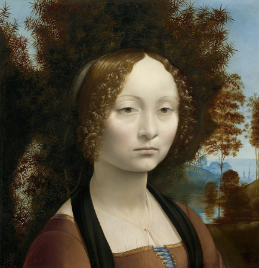

Chapitre 2

Quand j’ai terminé mes études supérieures en informatique, j’y suis allé
à une école d’art pour étudier la peinture. Beaucoup de gens semblaient
surpris que quelqu’un qui s’intéressait aux ordinateurs s’intéresse
aussi à la peinture. Ils semblaient penser que le bidouillage
informatique et la peinture étaient des types de travail très
différents - que le bidouillage était froid, précis et méthodique, et
que la peinture était l’expression frénétique d’une certaine envie
primitive.

Ces deux images sont erronées. Le bidouillage informatique et la
peinture ont beaucoup en commun. En fait, de tous les différents types
de personnes que j’ai connues, les pirates et les peintres sont parmi
les plus semblables.

Ce que les hackers et les peintres ont en commun, c’est qu’ils sont tous
deux des créateurs. Avec les compositeurs, les architectes et les
écrivains, ce que les hackers et les peintres essaient de faire, c’est
de faire de bonnes choses. Ils ne font pas de recherche en soi, mais si,
en essayant de faire de bonnes choses, ils découvrent une nouvelle
technique, tant mieux.

Je n’ai jamais aimé le terme « informatique ». La principale raison pour
laquelle je n’aime pas qu’il n’y en a pas. L’informatique attrape un sac
de zones faiblement liées jetées ensemble par un accident de l’histoire,
comme la Yougoslavie. À la fin, vous avez des gens qui sont vraiment
mathématiciens, mais appelez ce qu’ils font de l’informatique afin
qu’ils puissent obtenir des subventions DARPA. Au milieu, vous avez des
gens qui travaillent sur quelque chose comme l’histoire naturelle des
ordinateurs - qui étudient le comportement des algorithmes pour
acheminer les données à travers les réseaux, par exemple. Et puis à
l’autre extrême, vous avez les hackers, qui essaient d’écrire des
logiciels intéressants, et pour qui les informatiques ne sont qu’un
moyen d’expression, comme le béton est pour les architectes ou de la
peinture pour les peintres. C’est comme si les mathématiciens, les
physiciens et les architectes devaient tous être dans le même
département.

Parfois, ce que font les hackers est appelé « génie logiciel », mais ce
terme est tout aussi trompeur. Les bons concepteurs de logiciels ne sont
pas plus des ingénieurs que les architectes. La frontière entre
l’architecture et l’ingénierie n’est pas bien définie, mais elle est là.
Cela se situe entre quoi et comment : les architectes décident de ce
qu’il faut faire, et les ingénieurs trouvent comment le faire.

Quoi et comment ne doivent pas être gardés trop séparés. Vous demandez
des ennuis si vous essayez de décider quoi faire sans comprendre comment
le faire. Mais le bidouillage informatique peut certainement être plus
que simplement décider comment mettre en œuvre certaines spécifications.
À son meilleur, il crée la spécification, bien qu’il s’avère que la
meilleure façon de le faire est de la mettre en œuvre.

Peut-être qu’un jour, « l’informatique », comme la Yougoslavie, se
mettra dans ses composantes. Cela pourrait être une bonne chose. Surtout
si cela signifiait l’indépendance pour mon pays natal, le bidouillage.

Regrouper tous ces différents types de travail en un seul partage peut
être pratique sur le plan administratif, mais c’est déroutant
intellectuellement. C’est l’autre raison pour laquelle je n’aime pas le
nom de “l’informatique”. On peut soutenir que les gens du milieu font
quelque chose comme une science expérimentale. Mais les gens à chaque
extrémité, les hackers et les mathématiciens, ne font pas vraiment de
science.

Les mathématiciens ne semblaient pas s’en préoccuper. Ils se sont
heureusement mis au travail en prouvant des théorèmes comme les autres
mathématiciens du département de mathématiques, et ont probablement
bientôt cessé de remarquer que le bâtiment dans lequel ils travaillent
dit “informatique” à l’extérieur. Mais pour les hackers, cette étiquette
est un problème. Si ce qu’ils font s’appelle la science, cela leur donne
le sentiment qu’ils devraient agir scientifiquement. Donc, au lieu de
faire ce qu’ils veulent vraiment faire, c’est-à-dire concevoir de beaux
logiciels, les hackers des universités et des laboratoires de recherche
pensent qu’ils devraient écrire des articles de recherche.

Dans le meilleur des cas, les documents ne sont qu’une formalité. Les
hackers écrivent des logiciels cool, puis écrivent un article à ce
sujet, et le papier devient un proxy pour la réalisation représentée par
le logiciel. Mais souvent, cette inadéquation cause des problèmes. Il
est facile de s’éloigner de la construction de belles choses pour
construire des choses laides qui rendent les sujets plus appropriés pour
les documents de recherche.

Malheureusement, les belles choses ne sont pas toujours les meilleurs
sujets de recherche. Premièrement, la recherche doit être originale - et
comme tous ceux qui ont écrit une thèse ou un doctorat le savent, la
façon d’être sûr d’explorer un territoire vierge est de jalonner un
terrain que personne ne veut. Deuxièmement, la recherche doit être
substantielle - et les systèmes maladroits produisent des documents plus
charnus, parce que vous pouvez écrire sur les obstacles que vous devez
surmonter pour faire avancer les choses. Il n’y a rien de tel pour
résoudre les problèmes que de commencer avec des hypothèses erronées. La
majeure partie de l’IA est un exemple de cette règle ; si vous supposez
que la connaissance peut être représentée comme une liste d’expressions
logiques de prédicat dont les arguments représentent des concepts
abstraits, vous aurez beaucoup d’articles à écrire sur la façon de faire
en sorte que cela fonctionne. Comme le disait Ricky Ricardo, « Lucy, tu
as beaucoup d’explications à faire. »

La façon de créer quelque chose de beau est souvent de faire des
ajustements subtils à quelque chose qui existe déjà, ou de combiner des
idées existantes d’une manière légèrement nouvelle. Ce genre de travail
est difficile à transmettre dans un document de recherche.

Alors, pourquoi les universités et les laboratoires de recherche
continuent-ils de juger les hackers par les publications ? Pour la même
raison que “l’aptitude scolaire” est mesurée par des tests standardisés
simples d’esprit, ou la productivité des programmeurs par des lignes de
code. Ces tests sont faciles à appliquer, et il n’y a rien d’aussi
tentant qu’un test facile qui fonctionne.

Mesurer ce que les hackers essaient réellement de faire, concevoir de
beaux logiciels, serait beaucoup plus difficile. Vous avez besoin d’un
bon sens du design pour juger du bon design. Et il n’y a pas de
corrélation, sauf peut-être négative, entre la capacité des gens à
reconnaître un bon design et leur confiance qu’ils peuvent le faire.

Le seul test externe est le temps. Au fil du temps, les belles choses
ont tendance à prospérer, et les choses laides ont tendance à être
jetées. Malheureusement, le temps nécessaire peut être plus long que les
vies humaines. Samuel Johnson a déclaré qu’il a fallu cent ans pour que
la représentation d’un écrivain convergeant [^1]. Il faut attendre que
les amis influents de l’écrivain meurent, puis que tous leurs disciples
meurent.

Je pense que les hackers doivent juste se résigner à avoir une grande
composante aléatoire dans leur réputation. En cela, ils ne sont pas
différents des autres fabricants. En fait, ils ont de la chance en
comparaison. L’influence de la mode n’est pas aussi grande dans le
bidouillage que dans la peinture.

Il y a des choses pires que d’avoir des gens qui comprennent mal votre
travail. Un danger pire serait que vous vous mépreniez vous-même sur
votre travail. Les domaines connexes sont l’endroit où vous allez à la
recherche d’idées. Si vous vous trouvez dans le département
d’informatique, il y a une tentation naturelle de croire, par exemple,
que le bidouillage informatique est la version appliquée de ce que
l’informatique théorique est la théorie. Tout le temps que j’étais aux
études supérieures, j’avais un sentiment inconfortable au fond de mon
esprit que je devrais connaître plus de théorie, et que c’était très
négligent de ma part d’avoir oublié toutes ces choses dans les trois
semaines suivant l’examen final.

Maintenant, je me rends compte que je me suis trompé. Les hackers
doivent comprendre la théorie du calcul à peu près autant que les
peintres ont besoin de comprendre la chimie de la peinture. Vous devez
savoir comment calculer la complexité du temps et de l’espace, et
peut-être aussi le concept d’une machine d’état, au cas où vous voudriez
écrire un analyseur. Les peintres doivent se souvenir beaucoup plus de
la chimie de la peinture que cela.

J’ai constaté que les meilleures sources d’idées ne sont pas les autres
domaines qui ont le mot « ordinateur » dans leur nom, mais les autres
domaines habités par des fabricants. La peinture a été une source
d’idées beaucoup plus riche que la théorie du calcul.

Par exemple, on m’a appris à l’université qu’il faudrait écrire un
programme complètement sur papier avant même de s’approcher d’un
ordinateur. J’ai constaté que je n’avais pas programmé de cette façon.
J’ai trouvé que j’aimais programmer assis devant un ordinateur, pas un
morceau de papier. Pire encore, au lieu d’écrire patiemment un programme
complet et de m’assurer qu’il était correct, j’avais tendance à cracher
du code qui était désespérément cassé et à le mettre progressivement en
forme. Le débogage, de ce que l’on m’a appris, était une sorte de passe
finale où vous avez attrapé des fautes de frappe et des oublis. La façon
dont je travaillais, il semblait que la programmation consistait à
déboguer.

Pendant longtemps, je me suis senti mal à ce sujet, tout comme je me
suis senti mal de ne pas avoir tenu mon crayon comme ils me l’ont appris
à l’école primaire. Si seulement j’avais regardé les autres fabricants,
les peintres ou les architectes, j’aurais réalisé qu’il y avait un nom
pour ce que je faisais : faire des croquis. Pour autant que je sache, la
façon dont ils m’ont appris à programmer à l’université était tout à
fait fausse. Vous devriez comprendre les programmes au fur et à mesure
que vous les écrivez, tout comme les écrivains, les peintres et les
architectes.

Réaliser cela a de réelles implications pour la conception de logiciels.
Cela signifie qu’un langage de programmation devrait, avant tout, être
malléable. Un langage de programmation est pour penser à des programmes,
pas pour exprimer des programmes auxquels vous avez déjà pensé. Ce
devrait être un crayon, pas un stylo. La dactylographie statique serait
une bonne idée si les gens écrivaient réellement des programmes comme
ils me l’ont appris à l’université. Mais ce n’est pas comme ça que les
hackers que je connais écrivent des programmes. Nous avons besoin d’un
langage qui nous permet de griffonner et de frotter et de frotter, pas
d’un langage où vous devez vous asseoir avec une tasse de thé de types
équilibrés sur votre genou et avoir une conversation polie avec une
vieille tante stricte d’un compilateur.

Alors que nous sommes sur le sujet de la dactylographie statique,
l’identification avec les fabricants nous sauvera d’un autre problème
qui afflige les sciences : l’envie des mathématiques. Tout le monde dans
les sciences croit secrètement que les mathématiciens sont plus
intelligents qu’ils ne le sont. Je pense que les mathématiciens le
croient aussi. Quoi qu’il en soit, le résultat est que les scientifiques
ont tendance à rendre leur travail aussi mathématique que possible. Dans
un domaine comme la physique, cela ne fait probablement pas beaucoup de
mal, mais plus vous vous en tirez des sciences naturelles, plus cela
devient un problème.

Une page de formules a l’air si impressionnante. (Astuce : pour plus
d’impression, utilisez des variables grecques). Et il y a donc une
grande tentation pour travailler sur des problèmes que vous pouvez
traiter formellement, plutôt que sur des problèmes qui sont, disons,
importants.

Si les hackers s’identifiaient à d’autres fabricants, comme les
écrivains et les peintres, ils ne se sentiraient pas tentés de le faire.
Les écrivains et les peintres ne souffrent pas de l’envie des
mathématiques. Ils ont l’impression de faire quelque chose qui n’a aucun
rapport. Il en est de plus que les hackers, je pense.

Si les universités et les laboratoires de recherche empêchent les
hackers de faire le genre de travail qu’ils veulent faire, peut-être que
la place pour eux est dans les entreprises. Malheureusement, la plupart
des entreprises ne laisseront pas non plus les hackers faire ce qu’ils
veulent. Les universités et les laboratoires de recherche les forcent à
être des scientifiques, et les entreprises les forcent à être des
ingénieurs.

Je ne l’ai découvert moi-même que très récemment. Quand Yahoo a acheté
Viaweb, ils m’ont demandé ce que je voulais faire. Je n’avais jamais
beaucoup aimé les affaires, et j’ai dit que je voulais juste bidouiller.
Quand je suis arrivé à Yahoo, j’ai découvert que ce que le bidouillage
informatique signifiait pour eux, c’était d’implémenter un logiciel, et
non de le concevoir. Les programmeurs étaient considérés comme des
techniciens qui traduisaient les visions (si c’est le mot) des chefs de
produit en code.

Cela semble être le plan par défaut dans les grandes entreprises. Ils le
font parce que cela diminue l’écart-type du résultat. Seul un faible
pourcentage de hackers peut réellement concevoir des logiciels, et il
est difficile pour les personnes qui dirigent une entreprise de les
choisir. Ainsi, au lieu de confier l’avenir du logiciel à un brillant
hacker, la plupart des entreprises mettent les choses en place de
manière à ce qu’il soit conçu par un comité, et les hackers ne font que
mettre en œuvre la conception.

Si vous voulez gagner de l’argent à un moment donné, souvenez-vous de
cela, parce que c’est l’une des raisons pour lesquelles les startups
gagnent. Les grandes entreprises veulent diminuer l’écart-type des
résultats de conception parce qu’elles veulent éviter les catastrophes.
Mais lorsque vous amortissez les oscillations, vous perdez les points
hauts ainsi que les points bas. Ce n’est pas un problème pour les
grandes entreprises, car elles ne gagnent pas en fabriquant d’excellents
produits. Les grandes entreprises gagnent en aspirant moins que les
autres grandes entreprises.

Donc, si vous pouvez trouver un moyen d’entrer dans une guerre de design
avec une entreprise assez grande pour que son logiciel soit conçu par
des gestionnaires de produits, ils ne seront jamais en mesure de vous
suivre. Cependant, ces opportunités ne sont pas faciles à trouver. Il
est difficile d’engager une grande entreprise dans une guerre de design,
tout comme il est difficile d’engager un adversaire à l’intérieur d’un
château dans un combat au corps à corps. Il serait assez facile d’écrire
un meilleur traitement de texte que Microsoft Word, par exemple, mais
Microsoft, dans le château de son monopole du système d’exploitation, ne
le remarquerait probablement même pas si vous le faisiez.

L’endroit pour mener des guerres de design se trouve sur de nouveaux
marchés, où personne n’a encore réussi à établir des fortifications.
C’est là que vous pouvez gagner gros en adoptant l’approche audacieuse
de la conception et en ayant les mêmes personnes qui conçoivent et
mettent en œuvre le produit. Microsoft eux-mêmes l’ont fait au début.
Apple aussi. Et Hewlett- Packard. Je soupçonne que presque toutes les
start-ups à succès l’ont fait.

Donc, une façon de créer d’excellents logiciels est de démarrer votre
propre start-up. Il y a cependant deux problèmes avec cela. La première
est que dans une start-up, vous devez faire tellement de choses en plus
d’écrire des logiciels. Chez Viaweb, j’ai eu de la chance si je devais
bidouiller un quart du temps. Et les choses que j’ai dû faire les trois
autres quarts du temps allaient de fastidieuses à terrifiantes. J’ai une
référence pour cela, parce que j’ai déjà dû quitter une réunion du
conseil d’administration pour faire remplir quelques cavités. Je me
souviens m’être assis sur la chaise du dentiste, en attendant la fraise
et d’avoir l’impression d’être en vacances.

L’autre problème avec les startups est qu’il n’y a pas beaucoup de tour
entre le type de logiciel qui rapporte de l’argent et le type qui est
intéressant à écrire. Les langages de programmation sont intéressants à
écrire, et le premier produit de Microsoft en était un, en fait, mais
personne ne paiera pour les langages de programmation maintenant. Si
vous voulez gagner de l’argent, vous avez tendance à être obligé de
travailler sur des problèmes qui sont trop désagréables pour que
quelqu’un puisse les résoudre gratuitement.

Tous les fabricants sont confrontés à ce problème. Les prix sont
déterminés par l’offre et la demande, et il n’y a tout simplement pas
autant de demande pour des choses sur lesquelles il est amusant de
travailler que pour des choses qui résolvent les problèmes banaux des
clients individuels. Agir dans des pièces de théâtre off-Broadway ne
paie pas aussi bien que de porter un costume de gorille dans le stand de
quelqu’un lors d’un salon professionnel. Écrire des romans ne paie pas
aussi bien que d’écrire des textes publicitaires pour l’élimination des
ordures. Et le bidouillage informatique des langages de programmation ne
paie pas aussi bien que de trouver comment connecter l’ancienne base de
données d’une entreprise à son serveur web.

Je pense que la réponse à ce problème, dans le cas des logiciels, est un
concept connu de presque tous les fabricants : le travail de jour. Cette
phrase a commencé avec des musiciens, qui se produisent la nuit. Plus
généralement, cela signifie que vous avez un type de travail que vous
faites pour l’argent, et un autre pour l’amour.

Presque tous les fabricants ont un emploi de jour au début de leur
carrière. Les peintres et les écrivains le font notoirement. Si vous
avez de la chance, vous pouvez obtenir un emploi de jour étroitement lié
à votre vrai travail. Les musiciens semblent souvent travailler dans les
magasins de disques. Un hacker travaillant sur un langage de
programmation ou un système d’exploitation pourrait également être en
mesure d’obtenir un emploi de jour en l’utilisant [^2].

Quand je dis que la réponse est que les hackers ont des emplois de jour
et travaillent sur de beaux logiciels sur le côté, je ne propose pas
cela comme une nouvelle idée. C’est ce qu’est le piratage open source.
Ce que je dis, c’est que l’open source est probablement le bon modèle,
car il a été confirmé de manière indépendante par tous les autres
fabricants.

Il me semble surprenant que n’importe quel employeur soit réticent à
laisser les hackers travailler sur des projets open source. Chez Viaweb,
nous aurions été réticents à embaucher quelqu’un qui ne l’avait pas
fait. Lorsque nous avons interviewé les programmeurs, la principale
chose dont nous nous souciions était le type de logiciel qu’ils
écrivaient pendant leur temps libre. Vous ne pouvez rien faire vraiment
bien à moins que vous ne l’aimiez, et si vous aimez bidouiller, vous
travaillerez inévitablement sur vos propres projets [^3].

Parce que les hackers sont des créateurs plutôt que des scientifiques,
le bon endroit pour chercher des métaphores n’est pas dans les sciences,
mais parmi d’autres types de fabricants. Qu’est-ce que la peinture peut
nous apprendre d’autre sur le bidouillage informatique ?

Une chose que nous pouvons apprendre, ou du moins confirmer, de
l’exemple de la peinture est comment apprendre à bidouiller. Vous
apprenez à peindre principalement en le faisant. Idem pour le
bidouillage. La plupart des hackers n’apprennent pas à bidouiller en
suivant des cours universitaires de programmation. Ils apprennent en
écrivant leurs propres programmes à l’âge de treize ans. Même dans les
cours universitaires, vous apprenez à bidouiller principalement en
bidouillant [^4].

Parce que les peintres laissent derrière eux une traînée de travail,
vous pouvez les regarder apprendre en faisant. Si vous regardez l’œuvre
d’un peintre dans l’ordre chronologique, vous constaterez que chaque
peinture s’appuie sur des choses apprises dans les précédentes.
Lorsqu’il y a quelque chose dans une peinture qui fonctionne
particulièrement bien, vous pouvez généralement en trouver la version 1
sous une forme plus petite dans une peinture antérieure.

Je pense que la plupart des fabricants travaillent de cette façon. Les
écrivains et les architectes le sont aussi. Peut-être serait-il bon pour
les hackers d’agir plus comme des peintres, et de recommencer
régulièrement à zéro, au lieu de continuer à travailler pendant des
années sur un projet, et d’essayer d’incorporer toutes leurs idées
ultérieures en tant que révisions.

Le fait que les hackers apprennent à bidouiller en le faisant est un
autre signe de la différence entre le piratage des sciences. Les
scientifiques n’apprennent pas la science en le faisant, mais en faisant
des laboratoires et des ensembles de problèmes. Les scientifiques
commencent à faire un travail parfait, dans le sens où ils essaient
juste de reproduire le travail que quelqu’un d’autre a déjà fait pour
eux. Finalement, ils en arrivent au point où ils peuvent faire un
travail original. Alors que les hackers, dès le début, font un travail
original ; c’est juste très mauvais. Ainsi, les hackers commencent
l’original, et obtiennent de bons, et les scientifiques commencent bien,
et obtiennent l’original.

L’autre façon dont les fabricants apprennent est à partir d’exemples.
Pour un peintre, un musée est une bibliothèque de référence de
techniques. Pendant des centaines d’années, il fait partie de
l’éducation traditionnelle des peintres de copier les œuvres des grands
maîtres, car la copie vous oblige à regarder de près la façon dont une
peinture est faite.

Les écrivains le font aussi. Benjamin Franklin a appris à écrire en
résumant les points des essais d’Addison et de Steele, et en puis en
essayant de les reproduire. Raymond Chandler a fait la même chose avec
les romans policiers.

De même, les hackers peuvent apprendre à programmer en regardant de bons
programmes, non seulement sur ce qu’ils font, mais aussi sur le code
source. L’un des avantages les moins médiatisés du mouvement open source
est qu’il a facilité l’apprentissage de la programmation. Lorsque j’ai
appris à programmer, nous avons dû nous fier principalement à des
exemples dans les livres. Le seul gros morceau de code disponible à
l’époque était Unix, mais même celui-ci n’était pas open source. La
plupart des personnes qui ont lu la source l’ont lu dans des photocopies
illicites du livre de John Lions, qui, bien qu’il ait été écrit en 1977,
n’a pas été autorisé à être publié avant 1996.

Un autre exemple que nous pouvons prendre de la peinture est la façon
dont les peintures sont créées par un raffinement progressif. Les
peintures commencent généralement par un croquis. Peu à peu, les détails
sont remplis. Mais il ne s’agit pas simplement d’un processus de
remplissage. Parfois, les plans originaux sont erronés. D’innombrables
tableaux, lorsqu’on les regarde aux rayons X, il s’avère que des membres
ont été déplacés ou des traits du visage qui ont été réajustés.

Voici un cas où nous pouvons apprendre de la peinture. Je pense que le
bidouillage informatique devrait aussi fonctionner de cette façon. Il
est irréaliste de s’attendre à ce que les spécifications d’un programme
soient parfaites. Vous feriez mieux d’admettre cela à l’avance et
d’écrire des programmes d’une manière qui permet aux spécifications de
changer à la volée.

(La structure des grandes entreprises rend cela difficile à faire pour
elles, alors voici un autre endroit où les start-ups ont un avantage.)

Tout le monde connaît probablement maintenant le danger de
l’optimisation prématurée. Je pense que nous devrions être tout aussi
inquiets au sujet de la conception prématurée - en décidant trop tôt ce
qu’un programme devrait faire.

Les bons outils peuvent nous aider à éviter ce danger. Un bon langage de
programmation devrait, comme la peinture à l’huile, faciliter le
changement d’avis. La dactylographie dynamique est une victoire ici
parce que vous n’avez pas à vous engager dans des représentations de
données spécifiques dès le départ. Mais la clé de la flexibilité, je
pense, est de rendre le langage très abstrait. Le programme le plus
facile à changer est un programme court.

<figure>

<figcaption aria-hidden="true">Ginevra de’ Benci de Léonard de Vinci,
1474.</figcaption>
</figure>

Ginevra de’ Benci de Léonard de Vinci, 1474.

Cela ressemble à un paradoxe, mais une grande peinture doit être
meilleure qu’elle ne doit l’être. Par exemple, lorsque Léonard de Vinci
a peint le portrait de Ginevra de’ Benci à la National Gallery, il a mis
un buisson de genièvre derrière sa tête. Il y peignait soigneusement
chaque feuille. Beaucoup de peintres auraient pu penser que c’est juste
quelque chose à mettre en arrière-plan pour encadrer sa tête. Personne
ne le regardera de si près.

Pas Léonard de Vinci. La façon dont il a travaillé sur une partie d’une
peinture ne dépendait pas du tout de la façon dont il s’attendait à ce
que quelqu’un la regarde. Il était comme Michael Jordan. Implacable.

L’acharnement l’emporte parce que, dans l’ensemble, les détails
invisibles deviennent visibles. Quand les gens marchent près du portrait
de Ginevra de’ Benci, leur attention est souvent immédiatement attirée
par cela, même s’ils regardent l’étiquette et remarquent qu’elle dit
Léonard de Vinci. Tous ces détails invisibles se combinent pour produire
quelque chose qui est tout simplement étonnant, comme mille voix à peine
audibles qui chantent toutes en harmonie.

Un excellent logiciel, de même, nécessite un dévouement fanatique à la
beauté. Si vous regardez à l’intérieur de bons logiciels, vous trouvez
que les pièces que personne n’est jamais censé voir sont aussi belles.
Quand il s’agit de code, je me comporte d’une manière qui me rendrait
admissible aux médicaments sur ordonnance si j’abordais la vie
quotidienne de la même manière. Cela me rend fou de voir du code qui est
mal en retrait, ou qui utilise des noms de variables laids.

Si un hacker était un simple implémentateur, transformant une
spécification en code, alors il pourrait simplement se frayer un chemin
d’un bout à l’autre comme quelqu’un qui creuse un fossé. Mais si le
hacker est un créateur, nous devons tenir compte de l’inspiration.

Dans le bidouillage informatique, comme la peinture, le travail se fait
par cycles. Parfois, vous êtes enthousiasmé par un nouveau projet et
vous voulez y travailler seize heures par jour. D’autres fois, rien ne
semble intéressant.

Pour faire du bon travail, vous devez tenir compte de ces cycles, car
ils sont affectés par la façon dont vous y réagissez. Lorsque vous
conduisez une voiture avec une transmission manuelle sur une colline,
vous devez parfois reculer de l’embrayage pour éviter de décrocher. Le
retour en arrière peut également empêcher l’ambition de s’installer.
Dans la peinture et le bidouillage informatique, il y a certaines tâches
qui sont terriblement ambitieuses, et d’autres qui sont d’une routine
réconfortante. C’est une bonne idée de sauvegarder des tâches faciles
pour les moments où vous seriez autrement bloqué.

Dans le bidouillage informatique, cela peut littéralement signifier
sauver des bogues. J’aime le debugging : c’est la seule fois où le
bidouillage est aussi simple que les gens le pensent. Vous avez un
problème totalement limité, et tout ce que vous avez à faire est de le
résoudre. Votre programme est censé faire x. Au lieu de cela, il le
fait. Où cela va-t-il mal ? Tu sais que tu vas gagner à la fin. C’est
aussi relaxant que de peindre un mur.

L’exemple de la peinture peut nous apprendre non seulement comment gérer
notre propre travail, mais aussi comment travailler ensemble. Une grande
partie du grand art du passé est le travail de plusieurs mains, bien
qu’il n’y ait peut-être qu’un seul nom sur le mur à côté dans le musée.
Léonard de Vinci était apprenti dans l’atelier de Verrocchio et a peint
l’un des anges de son Baptême du Christ. Ce genre de choses était la
règle, pas l’exception. Michel-Ange a été considéré comme
particulièrement dévoué pour avoir insisté pour peindre toutes les
figures sur le plafond de la chapelle Sixtine lui-même.

Pour autant que je sache, lorsque les peintres travaillaient ensemble
sur une peinture, ils ne travaillaient jamais sur les mêmes parties. Il
était courant pour le maître de peindre les figures principales et pour
les assistants de peindre les autres et l’arrière-plan. Mais vous n’avez
jamais eu un gars qui peignait sur le travail d’un autre.

Je pense que c’est aussi le bon modèle pour la collaboration dans les
logiciels. Ne le poussez pas trop loin. Lorsqu’un morceau de code est
piraté par trois ou quatre personnes différentes, dont personne ne le
possède vraiment, il finira par être comme une salle commune. Il aura
tendance à se sentir sombre et abandonné, et à accumuler du cruft. La
bonne façon de collaborer, je pense, est de diviser les projets en
modules bien définis, chacun avec un propriétaire défini, et avec des
interfaces entre eux qui sont aussi soigneusement conçues et, si
possible, aussi articulées que les langages de programmation.

Comme la peinture, la plupart des logiciels sont destinés à un public
humain. Et donc les hackers, comme les peintres, doivent faire preuve
d’empathie pour faire un très bon travail. Vous devez être en mesure de
voir les choses du point de vue de l’utilisateur.

Quand j’étais enfant, on me disait constamment de regarder les choses du
point de vue de quelqu’un d’autre. Ce que cela signifiait toujours en
pratique, c’était de faire ce que quelqu’un d’autre voulait, au lieu de
ce que je voulais. Cela a bien sûr donné une mauvaise réputation à
l’empathie, et je me suis fait un point d’honneur de ne pas la cultiver.

Oh que j’avais tort. Il s’avère que regarder les choses du point de vue
des autres est pratiquement le secret du succès.

L’empathie ne signifie pas nécessairement être dévoué.e. Loin de ça.
Comprendre comment quelqu’un d’autre voit les choses n’implique pas que
vous agirez dans son intérêt ; dans certaines situations - en guerre,
par exemple - vous voulez faire exactement le contraire [^5].

La plupart des fabricants font des choses pour un public humain. Et pour
évaluer un public, vous devez comprendre ce dont il a besoin. Presque
toutes les plus grandes peintures sont des peintures de personnes, par
exemple, parce que les gens sont ce qui intéresse les gens.

L’empathie est probablement la différence la plus importante entre un
bon et un grand hacker. Certains sont assez intelligents, mais
pratiquement solipsistes en matière d’empathie. Il est difficile pour de
telles personnes de concevoir d’excellents logiciels, car elles ne
peuvent pas voir les choses du point de vue de l’utilisateur [^6].

Une façon de dire à quel point les gens sont bons en matière d’empathie
est de les regarder expliquer une question technique à quelqu’un qui n’a
pas de formation technique. Nous connaissons probablement tous des gens
qui, bien que par ailleurs intelligents, sont juste comiquement mauvais
dans ce domaine. Si quelqu’un leur demande lors d’un dîner ce qu’est un
langage de programmation, il dira quelque chose comme “Oh, un langage de
haut niveau est ce que le compilateur utilise comme entrée pour générer
du code objet”. Langue de haut niveau ? Compilateur ? Code objet ?
Quelqu’un qui ne sait pas ce qu’est un langage de programmation ne sait
évidemment pas non plus ce que sont ces choses.

Une partie de ce que les logiciels ont à faire est de s’expliquer. Donc,
pour écrire un bon logiciel, vous devez comprendre à quel point les
utilisateurs comprennent peu. Ils vont marcher jusqu’au logiciel sans
préparation, et il ferait mieux de faire ce qu’ils pensent qu’il fera,
parce qu’ils ne vont pas lire le manuel. Le meilleur système que j’ai
jamais vu à cet égard était le Macintosh original, en 1984. Il a fait ce
que le logiciel ne fait presque jamais : il a juste fonctionné [^7].

Le code source devrait également s’expliquer de lui-même. Si je pouvais
amener les gens à se souvenir d’une seule citation sur la programmation,
ce serait celle du début de la structure et de l’interprétation des
programmes informatiques [^8].

Les programmes doivent être écrits pour que les gens les lisent, et
seulement accessoirement pour que les machines les exécutent.

<figure>

<figcaption aria-hidden="true">Federico da Montefeltro de Piero della
Francesca, 1465-66 (détail).</figcaption>
</figure>

Federico da Montefeltro de Piero della Francesca, 1465-66 (détail).

Vous devez avoir de l’empathie non seulement pour vos utilisateurs, mais
aussi pour vos lecteurs. C’est dans votre intérêt, parce que vous serez
l’un d’entre eux. Beaucoup de hackers ont écrit un programme pour
découvrir, à leur retour six mois plus tard, qu’ils n’avaient aucune
idée de son fonctionnement. Je connais plusieurs personnes qui ont juré
Perl après de telles expériences [^9].

Le manque d’empathie est associé à l’intelligence, au point qu’il y a
même quelque chose de mode pour cela à certains endroits. Mais je ne
pense pas qu’il y ait de corrélation. Vous pouvez bien réussir en
mathématiques et en sciences naturelles sans avoir à apprendre
l’empathie, et les gens dans ces domaines ont tendance à être
intelligents, de sorte que les deux qualités en sont ainsi associées.
Mais il y a beaucoup de gens stupides qui sont aussi mauvais en
empathie.

Donc, si le bidouillage informatique fonctionne comme la peinture et
l’écriture, est-ce aussi cool ? Après tout, vous n’avez qu’une seule
vie. Vous pourriez aussi bien le consacrer à travailler sur quelque
chose de génial.

Malheureusement, il est difficile de répondre à la question. Il y a
toujours un grand décalage dans le prestige. C’est comme la lumière
d’une étoile lointaine. La peinture a du prestige maintenant grâce à
l’excellent travail que les gens ont fait il y a cinq cents ans. À
l’époque, personne ne pensait que ces peintures étaient aussi
importantes que nous le faisons aujourd’hui. Il aurait semblé très
étrange aux gens en 1465 que Federico da Montefeltro, le duc d’Urbino,
soit un jour surtout connu comme le gars au nez étrange dans un tableau
de Piero della Francesca.

Donc, bien que j’admette que le bidouillage informatique ne semble pas
aussi cool que la peinture maintenant, nous devons nous rappeler que la
peinture elle-même ne semblait pas aussi cool dans ses jours de gloire
qu’elle le fait maintenant.

Ce que nous pouvons dire avec une certaine confiance, c’est que ce sont
les jours de gloire du piratage. Dans la plupart des domaines, le grand
travail est fait tôt. Les peintures réalisées entre 1430 et 1500 sont
inégalées. Shakespeare est apparu juste au moment où le théâtre
professionnel était en train de naître, et a poussé le médium si loin
que chaque dramaturge a dû vivre dans son ombre. Albrecht Dürer a fait
la même chose avec la gravure, et Jane Austen avec le roman.

Encore et encore, nous voyons le même schéma. Un nouveau médium
apparaît, et les gens sont tellement enthousiastes qu’ils explorent la
plupart de ses possibilités au cours des deux premières générations. Le
bidouillage informatique semble être dans cette phase maintenant.

La peinture n’était pas, à l’époque de Léonard de Vinci, aussi cool que
son travail l’a fait. La façon dont le piratage s’avère cool dépendra de
ce que nous pouvons faire avec ce nouveau média.

[^1]: Johnson a écrit dans la préface de son Shakespeare :    « Il
    a longtemps survécu à son siècle, le terme communément fixé comme le
    test du mérite littéraire. Quels que soient les avantages qu’il
    pouvait autrefois tirer des allusions personnelles, des coutumes
    locales ou des opinions temporaires, ont été perdus pendant de
    nombreuses années ; et tout le choix de la gaieté ou du motif du
    chagrin, que les modes de vie artificielle lui offraient,
    n’obscurcissent maintenant que les scènes qu’ils éclairaient
    autrefois. Les effets de la faveur et de la concurrence sont à leur
    fin ; la tradition de ses amitiés et de ses inimitiés a péri ; ses
    œuvres ne soutiennent aucune opinion avec des arguments, ni ne
    fournissent à aucune faction des invectives ; elles ne peuvent se
    livrer à la vanité ni à la malignité satisfaite, mais sont lues sans
    autre raison que le désir de plaisir, et ne sont donc louées que
    lorsque le plaisir est obtenu…»

[^2]:

[^3]:

[^4]:

[^5]:

[^6]:

[^7]:

[^8]:

[^9]:
