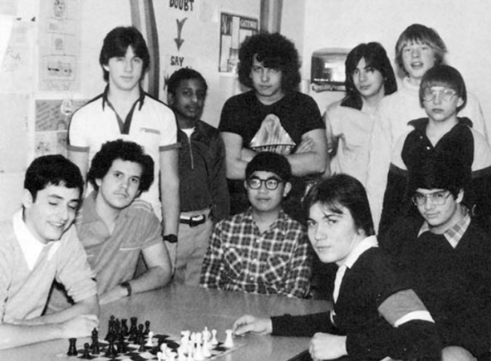

Chapitre 1

Quand on était en première année de lycée, mon ami Rich et moi-même
avons créé une sorte de carte en fonction de la popularité des gens. Ce
fût une chose facile à faire étant donné que les élèves ne mangent
qu’avec les gens avec la même popularité. Nous les avons noté de A à E.
Les tables A étaient composées des footballeurs, des cheerleaders et
ainsi de suite. Les tables E étaient quant à elles composées de gens
atteints de légers cas de trisomie, qu’on appelait en ces temps-là des
“attardés”.

Nous nous classions à la table D, le plus bas que vous pouviez vous
classer si votre physique n’était qu’ordinaire. Nous n’étions pas si
candides en nous plaçant à la table “D”. Ce serait mentir délibérément
que dire l’inverse. Tous les élèves du collège étaient au courant de la
popularité des autres, y compris la nôtre.

Je connais bon nombre de personnes qui étaient des nerds à l’école, et
toutes ces personnes disent la même chose : il y une forte corrélation
entre le fait d’être intelligent et être un “nerd”, et une corrélation
encore plus forte entre être populaire et être un “nerd”. Être
intelligent fait de vous une personne peu populaire.

Pourquoi me direz-vous ? Pour une personne actuellement à l’école, la
question semble un peu étrange. Ce simple fait était tellement
suffoquant qu’il était difficile de s’imaginer une autre voie. Mais cela
se pourrait. Être intelligent ne fait pas de vous un paria à l’école,
aussi bien qu’il ne vous portera pas préjudice dans la vraie vie. Aussi
loin que je puisse le dire, les problématiques sont les mêmes dans les
autres pays. Dans un lycée basique américain, être intelligent vous rend
la vie compliquée. Pourquoi ?

La clef de ce mystère est de légèrement reformuler la question. En
effet, pourquoi les enfants dits “intelligents” ne se rendent pas
populaires ? S’ils sont si intelligents, pourquoi n’arrivent-ils pas à
comprendre fonctionne la popularité et à battre le système comme ils le
feraient pour des tests standardisés ?

Un argument dit que cela serait impossible du fait que les autres
envient leur intelligence et que quoi qu’ils fassent, rien ne les rendra
populaires. Si les autres élèves de lycée m’enviaient, ils ont bien
occulté cette facette de leur personnalité. Qui plus est, si être
intelligent était une qualité à envier, les filles auraient cassé les
rangs.

Dans les écoles où je suis allé, être intelligent n’avait pas tant
d’importance. Les élèves ne l’adulaient ou ne le détestaient pas. Si
nous mettons une valeur équivalente, ils auraient choisi d’être du côté
intelligent plutôt que du côté des gens dits bêtes. D’un autre point de
vue, l’intelligence compte beaucoup moins que l’apparence physique, le
charisme ou les capacités athlétiques.

Si l’intelligence elle-même n’est pas un facteur de popularité, pourquoi
les enfants intelligents sont constamment peu populaires ? Pour moi, la
réponse est qu’ils ne veulent pas être populaires.

Si quelqu’un m’avait dit ça à l’époque, je me serais moqué de lui. Ne
pas être populaire à l’école fait d’eux des élèves si misérables que
certains en viennent au suicide. En me disant ne pas vouloir être
populaire, c’est comme dire que quelqu’un qui mourrait de soif dans un
désert refuserait un verre d’eau. Bien sûr que je souhaitais être
populaire.

Mais dans les faits, je le voulais, mais pas assez. Il y avait quelque
chose que je désirais plus : être intelligent. Pas simplement avoir de
bonnes notes à l’école ou avoir des pensées qui compteraient pour
quelque chose mais plutôt de construire de belles fusées, de bien écrire
ou encore de comprendre comment programmer un ordinateur. De façon plus
générale, de faire de belles choses.

A l’époque, je n’ai jamais pensé à séparer mes idées et les confronter
les unes aux autres. Si j’avais pu, j’aurais vu qu’être intelligent
était bien plus important. Si quelqu’un m’avait offert la possibilité
d’être l’enfant le plus populaire de l’école, mais au prix d’être doté
d’une intelligence moyenne (notez bien mon humour), je ne l’aurais pas
saisi.

Bien que ce manque de popularité les fasse souffrir, je ne pense pas que
la majorité des nerds le ferait. Pour eux, l’idée d’être dotée d’une
intelligence moyenne leur est insupportable, mais la majorité des
enfants aurait saisi l’opportunité. Pour la moitié d’entre eux, il
s’agit d’une amélioration. Même pour 80% d’entre eux (en supposant que,
comme tout le monde semblait le faire à l’époque, l’intelligence est un
échelon), qui ne céderait pas 30 points en échange de l’amour et de
l’admiration de tout le monde ?

Et ce, pour moi, est l’origine du problème. Les nerds servent deux
maîtres. Ils veulent être populaires, certes, mais ils veulent être
encore plus intelligents. Et la popularité n’est pas quelque chose que
l’on peut faire dans son temps libre, ni dans l’environnement férocement
compétitif d’un lycée américain.

Alberti, sans doute l’archétype de l’homme de la Renaissance, écrit
“qu’aucun art, aussi mineur soit-il, n’exige moins qu’un dévouement
total si l’on veut y exceller”[^1]. Je me demande si quelqu’un au monde
travaille plus dur que les écoliers américains à la popularité. La
Marine ou les résidents en neurochirurgie passent pour des fainéants en
comparaison. Ils prennent des vacances, certains ont même des hobbies.
Un adolescent américain s’efforce d’être populaire à chaque heure de la
journée, 365 jours par an.

Je ne veux pas dire qu’ils le font consciemment. Certains d’entre eux
sont vraiment des petits Machiavel, mais ce que je veux dire ici, c’est
que les adolescents sont toujours en devoir d’être conformistes.

Par exemple, les adolescents accordent une grande attention aux
vêtements. Ils ne s’habillent pas consciemment pour être populaires. Ils
s’habillent pour être beaux. Mais pour qui ? Pour les autres enfants.
L’opinion des autres devient leur définition du bien, pas seulement pour
les vêtements, mais pour presque tout ce qu’ils font, jusqu’à leur façon
de marcher. Et c’est ainsi que, chaque effort qu’ils font pour faire les
choses “correctement” est aussi, consciemment ou non, un effort pour
être plus populaire.

Les nerds ne s’en rendent pas compte. Ils ne réalisent pas que devenir
populaire demande du travail. En général, les personnes qui ne
travaillent pas dans un domaine très exigeant ne réalisent pas à quel
point la réussite dépend d’un effort constant (bien que souvent
inconscient). Par exemple, la plupart des gens semblent considérer la
capacité à dessiner comme une sorte de qualité innée, comme le fait
d’être grand. La taille. En réalité, la plupart des personnes qui
“savent dessiner” aiment dessiner et ont passé de nombreuses heures à le
faire; c’est pour cela qu’ils sont bons.

<figure>

<figcaption aria-hidden="true">
Club d’échecs du lycée Gateway, 1981. C’est moi en haut à gauche.
</figcaption>
</figure>

Club d’échecs du lycée Gateway, 1981. C’est moi en haut à gauche.

De même, la popularité n’est pas seulement quelque chose que l’on est ou
que l’on n’est pas, mais quelque chose que l’on fait soi-même.

La principale raison pour laquelle les nerds sont impopulaires est
qu’ils ont d’autres d’autres choses à penser. Leur attention est attirée
par les livres ou le ou le monde naturel, et non par les modes et les
fêtes. Ils sont comme quelqu’un qui essayait de jouer au football tout
en tenant un verre d’eau en équilibre sur sa tête. D’autres joueurs, qui
peuvent concentrer toute leur attention sur le jeu, les battent sans
effort et se demandent pourquoi ils semblent si incapables.

Même si les nerds se souciaient autant que les autres enfants de leur
popularité, être populaire leur demanderait plus d’efforts. Les enfants
populaires ont appris à être populaires et à vouloir l’être, de la même
façon que les nerds ont appris à être intelligents et à vouloir l’être
par leurs parents. Alors que les nerds étaient formés pour obtenir les
bonnes réponses, les enfants populaires étaient formés pour obtenir les
bonnes réponses.

Jusqu’à présent, j’ai peaufiné la relation entre intelligent et nerd, en
les utilisant comme interchangeables. De fait, seul le contexte permet
de les interchanger. Un nerd est quelqu’un pas assez adapté socialement.
Mais le “pas assez” dépend de là où vous êtes. Dans une école américaine
typique, les critères de coolitude sont si élevés (ou du moins si
spécifiques) qu’il n’est pas nécessaire d’être particulièrement
maladroit pour se faire remarquer (ou du moins, si spécifiques). Il
n’est pas nécessaire d’être particulièrement maladroit en comparaison.

Peu d’enfants intelligents peuvent se passer de l’attention qu’exige la
popularité. À moins qu’ils ne soient beaux, sportifs ou frères et sœurs
d’enfants populaires, ils auront tendance à devenir des intellos. C’est
la raison pour laquelle pourquoi la vie des gens intelligents est la
pire entre, disons, onze et dix-sept ans. À cet âge, la vie tourne
beaucoup plus autour de la popularité qu’avant ou après.

Avant cela, la vie des enfants est dominée par leurs parents, et non par
les autres enfants. Les enfants se soucient de ce que pensent leurs
pairs à l’école élémentaire, mais ça ne relève pas de leur vie entière,
ce qui le devient plus tard. Vers l’âge de onze ans, cependant, les
enfants semblent commencer à considérer leur famille comme un travail à
temps plein. Ils créent un nouveau monde entre eux, et c’est la position
dans ce monde qui compte, pas la position dans leur famille. En effet,
le fait d’avoir des problèmes dans leur famille peut leur faire gagner
des points dans le monde qui leur tient à cœur.

Le problème, c’est que le monde que ces enfants se créent est d’abord
très rudimentaire. Si vous laissez une bande de jeunes de onze ans à
leurs propres moyens, vous obtenez une version de Sa Majesté des
mouches. Comme beaucoup d’enfants américains, j’ai lu ce livre à
l’école. Ce n’était sans doute pas une coïncidence. On peut supposer que
quelqu’un voulait nous faire comprendre que nous étions des sauvages et
que nous avions créé un monde cruel et stupide.

C’était trop subtil pour moi. Bien que le livre semblait tout à fait
crédible, je n’ai pas compris le message véhiculé par l’auteur. J’aurais
préféré qu’il nous dise tout simplement que nous étions des sauvages et
que notre monde était stupide.

Les nerds trouveraient leur impopularité plus supportable si elle leur
permettait simplement d’être ignorés. Malheureusement être impopulaire à
l’école s’accompagne activement de persécutions.

Pourquoi ? Encore une fois, un individu actuellement au lycée pourrait
penser qu’il s’agit d’une étrange question. Comment les choses
pourraient être autrement ? Elles le pourraient. Les adultes ne
persécutent généralement pas les nerds . Mais pourquoi les adolescents
oui ?

En partie parce que les adolescents restent globalement des enfants, et
certains enfants sont simplement intrinsèquement cruels. Certains
torture les nerds comme d’autres arrachent les pattes à une araignée.
Avant le développement de la conscience, la torture est amusante.

Une autre raison pour laquelle les enfants persécutent les nerds est
qu’ils se sentent mieux. Lorsque vous marchez dans l’eau, vous vous
soulevez en poussant l’eau vers le bas. De même, dans toute hiérarchie
sociale, les personnes qui ne sont pas sûres de leur position essaieront
de la renforcer en maltraitant les autres. J’ai lu que c’est la raison
pour laquelle les Blancs pauvres aux États-Unis sont le groupe le plus
hostile envers les Noirs.

Mais je pense que la principale raison pour laquelle les autres enfants
persécutent les nerds est que cela fait partie du mécanisme de
popularité. La popularité n’est que partiellement à propos de l’attrait
individuel. C’est bien plus une question d’alliances. Pour devenir plus
populaire, vous devez constamment faire des choses qui vous rapprochent
d’autres personnes populaires, et rien ne rapproche plus les gens qu’un
ennemi commun.

Comme un politicien qui veut distraire les électeurs de la mauvaise
conjoncture de son pays, on peut créer un ennemi s’il n’y en a pas de
réel. En en persécutant un nerd, un groupe d’enfants plus haut placés
dans la hiérarchie crée des liens entre eux. plus haut dans la
hiérarchie. L’attaque d’un outsider fait d’eux tous des insiders. C’est
pourquoi les pires cas de persécution se produisent en groupe. Demandez
à n’importe quel nerd : un groupe d’enfants vous traite bien plus mal
que de n’importe quel intimidateur individuel, aussi sadique soit-il.

Si cela peut consoler les nerds, il n’y a rien de personnel. Le cercle
d’enfants qui s’unissent pour s’en prendre à vous fait la même chose, et
pour la même raison, qu’une bande de gars qui se réunissent pour aller à
la chasse. Ils ne vous détestent pas vraiment. Ils ont juste besoin de
quelque chose à chasser.

Parce qu’ils sont au bas de l’échelle, les nerds sont une cible sûre
pour toute l’école. Si je me souviens bien, les enfants les plus les
plus populaires ne persécutent pas les nerds, ils n’ont pas besoin de
s’abaisser à de telles choses. La plupart des persécutions viennent des
enfants du bas de l’échelle les classes moyennes nerveuses.

Le problème, c’est qu’il y en a beaucoup. La distribution de la
popularité n’est pas une pyramide, mais se rétrécit vers le bas comme
une poire. Le groupe le moins populaire est assez petit (je crois que
nous étions la seule table D sur la carte de notre cafétéria). Il y a
donc plus de gens qui veulent s’en prendre aux nerds qu’il n’y a de
nerds.

Tout comme on gagne des points en s’éloignant des enfants impopulaires,
on en perd en étant proche d’eux. Une femme que je connais raconte qu’au
lycée, elle aimait bien les nerds, mais qu’elle avait peur d’être vue en
train de leur parler parce que les autres filles se seraient moquées
d’elle. L’impopularité est une maladie contagieuse ; les enfants trop
gentils pour s’en prendre aux nerds seront toujours mis à l’écart.

Il n’est donc pas étonnant que les enfants intelligents aient tendance à
être malheureux au collège et au lycée. Leurs autres centres d’intérêt
ne leur laissent que peu d’attention à consacrer à la popularité, et
comme la popularité ressemble à un jeu à somme nulle, cela fait d’eux
des cibles pour l’ensemble de l’école. Et ce qui est étrange, c’est que
ce scénario cauchemardesque se produit sans aucune malveillance
consciente, simplement en raison de la forme de la situation.

Pour moi, la pire période a été le collège, quand la culture des enfants
était nouvelle et dure, et que la spécialisation qui séparerait plus
tard progressivement les enfants les plus intelligents n’avait pas
encore commencé. Presque tous ceux à qui j’ai parlé sont d’accord : le
point le plus bas se situe quelque part entre onze et quatorze ans.

Dans notre école, il s’agissait de la quatrième, ce qui correspondait à
l’âge de douze et treize ans pour moi. Il y a eu une brève sensation
cette année-là quand l’une de nos enseignantes a surpris un groupe de
filles attendant le bus scolaire, et fut tellement choquée que le
lendemain, elle consacra toute la classe à un éloquent plaidoyer pour
que les filles ne soient pas aussi cruelles les unes envers les autres.

Il n’a pas eu d’effet notable. Ce qui m’a frappé à l’époque c’est
qu’elle était surprise. Vous voulez dire qu’elle ne connaît pas le genre
de choses qu’ils se disent ? Vous voulez dire que ce n’était pas normal
?

Il est important de comprendre que, non, les adultes ne savent pas ce
que les enfants se font les uns aux autres. Ils savent, dans l’abstrait,
que les enfants sont monstrueusement cruels les uns envers les autres,
tout comme nous savons dans l’abstrait que des gens sont torturés dans
les pays pauvres. Mais, comme nous, ils n’aiment pas s’attarder sur ce
fait déprimant, et ils ne voient pas de preuves d’abus spécifiques à
moins qu’ils ne cherchent à en savoir plus.

Les enseignants des écoles publiques sont dans la même situation que les
gardiens de prison. La principale préoccupation des gardiens est de
maintenir les prisonniers dans les locaux. Ils doivent également les
nourrir et, dans la mesure du possible, les empêcher de s’entretuer. En
outre, ils veulent avoir le moins possible à faire avec les prisonniers,
et ils les laissent donc créer l’organisation sociale qu’ils souhaitent.
D’après ce que j’ai lu, la société créée par les prisonniers est tordue,
sauvage et omniprésente, et ce n’est pas drôle d’être au fond de cette
société.

Dans les grandes lignes, c’était la même chose dans les écoles que j’ai
fréquentées. La chose la plus importante était de rester sur place.
Pendant ce temps, les autorités vous nourrissaient, empêchaient toute
violence manifeste et s’efforçaient de vous enseigner quelque chose.
Mais au-delà de cela, ils ne voulaient pas avoir à trop faire avec les
enfants. Comme des gardiens de prison, les enseignants nous laissaient
le plus souvent livrés à nous-mêmes. Et, comme les prisonniers, la
culture que nous avons créée était barbare.

Pourquoi le monde réel est-il plus accueillant pour les nerds ? On
pourrait croire que la réponse est simplement qu’il est peuplé
d’adultes, trop matures pour se moquer les uns des autres. Mais je ne
pense pas que ce soit vrai. Les adultes en prison s’en prennent
certainement les uns aux autres. Il en va de même, apparemment, pour les
épouses de la société. Dans certains quartiers de Manhattan, la vie des
femmes ressemble à une continuation du lycée, avec toutes les mêmes
petites intrigues.

Je pense que ce qui est important dans le monde réel, ce n’est pas qu’il
soit peuplé d’adultes, mais qu’il soit très vaste, et que les choses que
vous faites ont de réels effets. C’est ce qui manque à l’école, à la
prison et aux femmes apprêtées. Les habitants de ces mondes sont
enfermés dans de petites bulles où rien de ce qu’ils font ne peut avoir
plus qu’un effet local. Naturellement, ces sociétés dégénèrent en
sauvagerie. Elles n’ont pas de fonction à suivre pour leur forme.

Lorsque les choses que vous faites ont des effets réels, il ne suffit
plus d’être plaisant. Il commence à être important d’obtenir les bonnes
réponses, et c’est là que les nerds se montrent à leur avantage. Bill
Gates vient évidemment à l’esprit. Bien qu’il soit notoirement dépourvu
de compétences sociales, il obtient les bonnes réponses, du moins, en
termes de revenus.

L’autre particularité du monde réel est qu’il est beaucoup plus vaste.
Dans un bassin suffisamment vaste, même les plus petites minorités
peuvent atteindre une masse critique si elles se regroupent. Dans le
monde réel, les nerds se rassemblent dans certains endroits et forment
leurs propres sociétés où l’intelligence est la chose la plus
importante. Parfois le courant commence à passer même dans l’autre sens
: parfois, notamment dans les départements de mathématiques et de
sciences des universités, les nerds se rassemblent pour former des
sociétés où l’intelligence est la chose la plus importante. John Nash
admirait tellement Norbert Wiener qu’il a pris son habitude de toucher
le mur en marchant dans un couloir.

À treize ans, je n’avais pas beaucoup plus d’expérience du monde que ce
que je voyais immédiatement autour de moi. Le petit monde déformé dans
lequel nous vivions était, à mon avis, le monde. Le monde semblait cruel
et ennuyeux, et je ne sais pas lequel des deux était le pire.

Parce que je ne m’intégrais pas dans ce monde, je pensais qu’il devait
avoir un problème avec moi. Je n’ai pas réalisé que la raison pour
laquelle nous les nerds ne s’intégraient pas, c’est que d’une certaine
manière, nous avions une longueur d’avance. Nous pensions déjà au genre
de choses qui comptent dans le monde réel, au lieu de passer tout notre
temps à jouer à un jeu exigeant mais surtout sans intérêt, comme les
autres.

Nous étions un peu comme un adulte qui se retrouverait au collège. Il ne
saurait pas quels vêtements porter, la bonne musique aimer, le bon argot
à utiliser. Il aurait semblé aux yeux des enfants un véritable
extraterrestre. Le truc, c’est qu’il en saurait assez pour ne pas se
soucier de ce qu’ils pensaient. Nous n’avions pas cette confiance.

Beaucoup de gens semblent penser qu’il est bon pour les enfants
intelligents d’être jetés avec des enfants “normaux” à ce stade de leur
vie. C’est possible. Mais dans certains cas, au moins, la raison pour
laquelle les nerds ne s’intègrent pas est que tous les autres sont fous.
Je me souviens d’avoir assisté à un “pep rally” dans mon lycée, et
d’avoir vu les pom-pom girls lancer l’effigie d’un joueur adverse dans
l’assistance pour qu’elle soit mise en pièces. J’avais l’impression
d’être un explorateur témoin d’un rituel tribal.

Si je pouvais revenir en arrière et donner quelques conseils à mon fils
de treize ans, la principale chose que je lui dirais serait de lever la
tête et de regarder autour de lui. Je ne l’ai pas vraiment compris à
l’époque, mais le monde dans lequel nous vivions était aussi faux qu’un
Twinkie. Pas seulement l’école, mais la ville entière. Pourquoi les gens
s’installent-ils en banlieue ? Pour avoir des enfants ! Alors, pas
étonnant que la ville semble ennuyeuse et stérile. L’endroit entier
était une ville artificielle créée explicitement dans le but d’élever
des enfants.

Là où j’ai grandi, j’avais l’impression qu’il n’y avait nulle part où
aller et rien à faire. Ce n’est pas un hasard. Les banlieues sont
délibérément conçues pour exclure le monde extérieur, parce qu’il
contient des choses qui pourraient mettre en danger les enfants.

Quant aux écoles, elles n’étaient que des enclos de ce monde factice.
Officiellement , leur but est d’enseigner aux enfants. En fait, leur but
premier est de garder les enfants enfermés dans un même endroit pendant
une grande partie de la journée pour que les adultes fassent ce qu’ils
ont à faire. Et je n’y vois pas d’inconvénient : dans une société
industrielle spécialisée, il serait désastreux d’avoir des enfants en
liberté.

Ce qui me dérange, ce n’est pas que les enfants soient enfermés dans des
prisons, mais (A) qu’ils n’en soient pas informés et (B) que les prisons
soient gérées principalement par les détenus. Les enfants sont envoyés
passer six ans à mémoriser des faits sans signification dans un monde
gouverné par une caste de géants qui dirigent la société qui courent
après une balle de football américain, comme s’il s’agissait de la chose
la plus naturelle au monde. Et s’ils rechignent devant ce cocktail
surréaliste, on les appelle des inadaptés.

La vie dans ce monde tordu est stressante pour les enfants. Et pas
seulement pour les nerds. Comme toute guerre, elle est préjudiciable
même aux vainqueurs. Les adultes ne peuvent s’empêcher de voir que les
adolescents sont tourmentés. Alors, pourquoi ne font-ils rien pour y
remédier ? Parce qu’ils mettent cela sur le compte de la puberté. Les
adultes se disent que si les enfants sont si malheureux, c’est parce que
de nouvelles substances chimiques La raison pour laquelle les enfants
sont si malheureux, c’est que de nouveaux produits chimiques monstrueux,
les hormones, circulent maintenant dans leur sang et perturbent tout. Il
n’y a rien qui cloche dans le système ; il est juste inévitable que les
enfants soient malheureux à cet âge.

Cette idée est tellement répandue que même les enfants y croient, ce qui
n’aide probablement pas. Quelqu’un qui pense que ses pieds lui font
naturellement mal ne va pas s’arrêter pour envisager la possibilité
qu’il porte des chaussures à la mauvaise taille.

Je me méfie de cette théorie selon laquelle les enfants de treize ans
sont intrinsèquement dérangés. Si c’était physiologique, cela devrait
être universel. Les nomades mongols sont-ils tous nihilistes à treize
ans ? J’ai lu beaucoup d’histoires, et je n’ai pas vu une seule
référence à ce fait prétendument universel avant le vingtième siècle.
Les apprentis adolescents de la Renaissance semblent avoir été joyeux et
enthousiastes. Ils se bagarraient et se jouaient des tours, bien sûr
(Michel-Ange a eu le nez cassé par une brute), mais ils n’étaient pas
fous.

Pour autant que je sache, le concept de l’adolescentaux hormones en
folie coexiste avec la banlieue. Je ne pense pas qu’il s’agisse d’une
coïncidence. Je pense que les adolescents sont rendus fous par la vie
qu’on leur fait mener. Les aprentis adolescents de la Renaissance
étaient des chiens de travail. Les adolescents d’aujourd’hui sont des
chiens d’appartement névrosés. La folie est la folie des désoeuvrés
partout.Lorsque j’étais à l’école, le suicide était un sujet récurrent
parmi les enfants les plus intelligents. Personne que je connaissais ne
l’a fait, mais plusieurs en ont eu l’intention,et certains ont peut-être
essayé. La plupart du temps, il s’agissait d’une simple pose. Comme
d’autres adolescents, nous aimions ce qui était dramatique, et le
suicide semblait très dramatique. Mais c’est en partie parce que nos
vies étaient parfois véritablement misérables.

Le harcèlement n’était qu’une partie du problème. Un autre problème,
peut-être encore plus grave, est que nous n’avons jamais rien eu de
concret à travailler. Les humains aiment travailler ; dans la plupart
des pays du monde, votre travail est votre identité. Et tout le travail
que nous faisions était inutile, ou en tout cas semblait l’être à
l’époque.

Au mieux, il s’agissait d’une pratique pour un travail réel que nous
pourrions effectuer si loin que nous ne savions même pas à l’époque à
quoi nous nous entraînions. Le plus souvent, il s’agissait simplement
d’une série arbitraire de cerceaux à franchir, de mots sans contenu
conçus principalement pour la testabilité (Les trois principales causes
de la guerre civile étaient…. Test : Énumérer les trois principales
causes de la guerre civile).

Et il n’y avait aucun moyen de se retirer. Les adultes avaient convenu
entre eux que ce serait la voie pour se diriger vers l’université. La
seule façon d’échapper à cette vie vide était de s’y soumettre.

Les adolescents avaient un rôle plus actif dans la société. À l’époque
préindustrielle, ils étaient tous des apprentis d’une sorte ou d’une
autre, que ce soit dans des magasins, dans des fermes ou même sur des
navires de guerre. Ils n’ont pas été laissés pour créer leurs propres
sociétés. Ils étaient des membres plus jeunes de sociétés adultes.

Les adolescents semblent avoir plus respecté les adultes à ce moment-là,
parce que les adultes étaient les experts visibles des compétences
qu’ils essayaient d’apprendre. Maintenant, la plupart des enfants ont
peu d’idée de ce que leurs parents font dans leurs bureaux éloignés, et
ne voient aucun lien (en fait, il y a précisément peu de choses) entre
le travail scolaire et le travail qu’ils feront à l’âge adulte.

Et si les adolescents respectaient davantage les adultes, les adultes
seraient également plus utiles pour les adolescents. Après quelques
années de formation, un apprenti pourrait être d’une réelle aide. Même
le plus récent apprenti pourrait être fait pour porter des messages ou
balayer l’atelier.

Maintenant, les adultes n’ont pas d’utilité immédiate pour les
adolescents. Ils seraient sur le chemin dans un bureau. Ils les déposent
donc à l’école sur le chemin du travail, tout comme ils pourraient
déposer le chien dans un chenil s’ils partaient pour le week-end.

Que s’est-il passé ? Nous sommes confrontés à un fait dur ici. La cause
de ce problème est la même que la cause de tant de maux actuels : la
spécialisation. Au fur et à mesure que les emplois deviennent plus
spécialisés, nous devons nous former plus longtemps pour eux. Les
enfants de l’époque préindustrielle ont commencé à travailler à environ
14 ans au plus tard ; les enfants des fermes, où la plupart des gens
vivaient, ont commencé beaucoup plus tôt. Maintenant, les enfants qui
vont à l’université ne commencent pas à travailler à temps plein jusqu’à
21 ou 22 ans. Avec certains diplômes, comme les médecins et les
doctorats, vous ne terminerez peut-être pas votre formation avant 30
ans.

Les adolescents sont maintenant inutiles, sauf en tant que main-d’œuvre
bon marché dans des industries comme la restauration rapide, qui a
évolué pour exploiter précisément ce fait. Dans presque tous les autres
types de travail, ils seraient une perte nette. Mais ils sont aussi trop
jeunes pour être laissés sans surveillance. Quelqu’un doit veiller sur
eux, et le moyen le plus efficace de le faire est de les rassembler en
un seul endroit. Ensuite, quelques adultes peuvent tous les regarder.

Si vous vous arrêtez là, ce que vous décrivez est littéralement une
prison, bien qu’à temps partiel. Le problème est que de nombreuses
écoles s’arrêtent pratiquement là. Le but déclaré des écoles est
d’éduquer les enfants. Mais il n’y a pas de pression extérieure pour
bien le faire. Et donc la plupart des écoles font un si mauvais travail
d’enseignement que les enfants ne le prennent pas vraiment au sérieux,
pas même les enfants intelligents. La plupart du temps, nous étions
tous, étudiants et enseignants, juste en train de passer par le
mouvement.

Dans ma classe de français au lycée, nous étions censés lire Les
Misérables d’Hugo. Je ne pense pas que l’un d’entre nous connaisse assez
bien le français pour se frayer un chemin à travers cet énorme livre.
Comme le reste de la classe, j’ai parcouru les Notes de Cliff. Quand on
nous a donné un test sur le livre, j’ai remarqué que les questions
semblaient bizarres. Ils étaient pleins de longs mots que notre
professeur n’aurait pas utilisés. D’où venaient ces questions ? D’après
les Notes de Cliff, il s’est avéré. Le professeur les utilisait aussi.
Nous faisions tous semblant.

Il y a certainement d’excellents enseignants des écoles publiques.
L’énergie et l’imagination de mon professeur de CM1, M. Mihalko, ont
fait de cette année quelque chose dont ses élèves parlent encore, trente
ans plus tard. Mais les enseignants comme lui étaient des individus
nageant en amont. Ils n’ont pas pu réparer le système.

Dans presque tous les groupes de personnes, vous trouverez une
hiérarchie. Lorsque des groupes d’adultes se forment dans le monde réel,
c’est généralement dans un but commun, et les dirigeants finissent par
être ceux qui sont les meilleurs dans ce domaine. Le problème avec la
plupart des écoles, c’est qu’elles n’ont pas de but. Mais il doit y
avoir une hiérarchie. Et donc les enfants en font une à partir de rien.

Nous avons une phrase pour décrire ce qui se passe lorsque des
classements doivent être créés sans aucun critère significatif. Nous
disons que la situation dégénère en un concours de popularité. Et c’est
exactement ce qui se passe dans la plupart des écoles américaines. Au
lieu de dépendre d’un test réel, son rang dépend principalement de sa
capacité à augmenter son rang. C’est comme la cour de Louis XIV. Il n’y
a pas d’adversaire externe, donc les enfants deviennent les adversaires
les uns des autres.

Lorsqu’il y a un véritable test externe de compétence, il n’est pas
douloureux d’être au bas de la hiérarchie. Une recrue d’une équipe de
football n’aime pas l’habileté du vétéran; il espère être comme lui un
jour et est heureux d’avoir la chance d’apprendre de lui. Le vétéran
peut à son tour ressentir un sentiment de noblesse oblige. Et plus
important encore, leur statut dépend de la façon dont ils s’en sortent
contre leurs adversaires, et non de s’ils peuvent pousser l’autre vers
le bas.

Les hiérarchies judiciaires sont une toute autre chose. Ce type de
société déprécie quiconque y entre. Il n’y a ni admiration en bas, ni
noblesse oblige en haut. C’est tuer ou être tué.

C’est le genre de société qui se crée dans les écoles secondaires
américaines. Et cela se produit parce que ces écoles n’ont aucun but
réel au-delà de garder les enfants au même endroit pendant un certain
nombre d’heures chaque jour. Ce dont je ne me suis pas rendu compte à
l’époque, et en fait je ne l’ai pas réalisé jusqu’à très récemment,
c’est que les horreurs jumelles de la vie scolaire, la cruauté et
l’ennui, ont toutes deux la même cause.

La médiocrité des écoles publiques américaines a de pires conséquences
que de rendre les enfants malheureux pendant six ans. Il engendre une
fausseté qui éloigne activement les enfants des choses qu’ils sont
censés apprendre.

Comme beaucoup de nerds, probablement, c’était des années après le lycée
avant que je puisse me résoudre à lire tout ce qui nous avait été
assigné à ce moment-là. Et j’ai perdu plus que des livres. Je me méfiais
des mots comme “caractère” et “intégrité” parce qu’ils avaient été
tellement défaits par les adultes. Comme ils ont été utilisés alors, ces
mots semblaient tous signifier la même chose : l’obéissance. Les enfants
qui ont été loués pour ces qualités avaient tendance à être au mieux des
taureaux de prix ternes et au pire des schmoozers faciles. Si c’était ce
qu’étaient le caractère et l’intégrité, je ne voulais pas en faire
partie.

Le mot que j’ai le plus mal compris était “tact”. Comme utilisé par les
adultes, cela semblait signifier de garder la bouche fermée. J’ai
supposé qu’il était dérivé de la même racine que “tacit” et “taciturne”,
et que cela signifiait littéralement être silencieux. J’ai juré que je
ne serais jamais avec tact ; ils n’allaient jamais me faire taire. En
fait, il est dérivé de la même racine que “tactile”, et ce que cela
signifie, c’est d’avoir une touche habile. Faire preuve de tact est le
contraire de maladroit. Je ne pense pas avoir appris cela avant
l’université.

Les nerds ne sont pas les seuls perdants dans la course aux rats de
popularité. Les nerds sont impopulaires parce qu’ils sont distraits. Il
y a d’autres enfants qui se retirent délibérément parce qu’ils sont
tellement dégoûtés par l’ensemble du processus.

Les adolescents, même les rebelles, n’aiment pas être seuls, donc
lorsque les enfants se retirent du système, ils ont tendance à le faire
en tant que groupe. Dans les écoles où je suis allé, l’accent de la
rébellion était mis sur la consommation de drogues, en particulier la
marijuana. Les enfants de cette tribu portaient des t-shirts de concert
noirs et étaient appelés “freaks”.

Les freaks et les nerds étaient des alliés, et il y avait beaucoup de
chevauchement entre eux. Les freaks étaient dans l’ensemble plus
intelligents que les autres enfants, bien que ne jamais étudier (ou du
moins ne jamais paraître) soit une valeur tribale importante. J’étais
plus dans le camp de nerds, mais j’étais ami avec beaucoup de freaks.

Ils ont consommé de la drogue, du moins au début, pour les liens sociaux
qu’ils ont créés. C’était quelque chose à faire ensemble, et parce que
les drogues étaient illégales, c’était un insigne partagé de rébellion.

Je ne prétends pas que les mauvaises écoles soient la raison pour
laquelle les enfants ont des soucis avec la drogue. Après un certain
temps, les drogues ont leur propre élan. Il ne fait aucun doute que
certains des freaks ont finalement utilisé de la drogue pour échapper à
d’autres problèmes - des problèmes à la maison, par exemple. Mais, au
moins dans mon école, la raison pour laquelle la plupart des enfants ont
commencé à consommer de la drogue était la rébellion. Les enfants de
quatorze ans n’ont pas commencé à fumer des joints parce qu’ils avaient
entendu dire que cela les aiderait à oublier leurs problèmes. Ils ont
commencé parce qu’ils voulaient rejoindre une tribu différente.

La mauvaise gouvernance engendre la rébellion ; ce n’est pas une idée
nouvelle. Et pourtant, les autorités agissent toujours pour la plupart
comme si les drogues étaient elles-mêmes la cause du problème.

Le vrai problème est le vide de la vie scolaire. Nous ne verrons pas de
solutions tant que les adultes ne s’en rendront pas compte. Les adultes
qui peuvent s’en rendre compte en premier sont ceux qui étaient
eux-mêmes des nerds à l’école. Voulez-vous que vos enfants soient aussi
malheureux en quatrième que vous ? Je ne le ferais pas. Eh bien, alors,
y a-t-il quelque chose que nous puissions faire pour réparer les choses
? Presque certainement. Il n’y a rien d’inévitable dans le système
actuel. Cela s’est passé principalement par défaut [^2].

Les adultes, cependant, sont occupés. Se présenter aux pièces de théâtre
de l’école est une chose. S’en prendre à la bureaucratie éducative en
est une autre. Peut-être que quelques-uns auront l’énergie d’essayer de
changer les choses. Je soupçonne que la partie la plus difficile est de
réaliser que vous le pouvez.

Les nerds encore à l’école ne devraient pas retenir leur souffle.
Peut-être qu’un jour, une force lourde d’adultes se présentera dans des
hélicoptères pour vous secourir, mais ils ne viendront probablement pas
ce mois-ci. Toute amélioration immédiate de la vie des nerds devra
probablement venir des nerds eux-mêmes.

Le simple fait de comprendre la situation dans laquelle ils sont devrait
la rendre moins douloureuse. Les nerds ne sont pas des perdants. Ils
jouent juste à un jeu différent, et un jeu beaucoup plus proche de celui
joué dans le monde réel. Les adultes le savent. Il est difficile de
trouver des adultes qui réussissent maintenant qui ne prétendent pas
avoir été des nerds au lycée.

Il est important que les nerds se rendent compte aussi que l’école n’est
pas la vie. L’école est une chose étrange et artificielle, à moitié
stérile et à moitié sauvage. C’est tout compris, comme la vie, mais ce
n’est pas la vraie chose. Ce n’est que temporaire, et si vous regardez,
vous pouvez voir au-delà même lorsque vous y êtes encore.

Si la vie semble horrible aux enfants, ce n’est ni parce que les
hormones vous transforment tous en monstres (comme vos parents le
croient), ni parce que la vie est en fait horrible (comme vous le
croyez). C’est parce que les adultes, qui n’ont plus aucune utilité
économique pour vous, vous ont abandonné pour passer des années enfermés
ensemble sans rien de réel à faire. Il est horrible de vivre dans
n’importe quelle société de ce type. Vous n’avez pas besoin de chercher
plus loin pour expliquer pourquoi les adolescents sont malheureux.

J’ai dit des choses dures dans cet essai, mais la thèse est vraiment
optimiste - que plusieurs problèmes que nous tenons pour acquis ne sont
en fait pas insolubles après tout. Les adolescents ne sont pas
intrinsèquement des monstres malheureux. Cela devrait être une nouvelle
encourageante pour les enfants et les adultes.

[^1]: Alberti, Leon Battista, The Use and Abuse of Books, traduit par
    Renée Watkins, Waveland Press, 1999.

[^2]: Alors, comment réparez-vous les écoles ? La clé de la réponse peut
    être l’université. Lorsque vous allez dans (une bonne) université,
    la plupart des problèmes que je décris sont résolus. La solution
    peut donc venir de la question suivante : comment faire en sorte que
    la vie des nerds adolescents ressemble davantage à la vie
    universitaire ?    L’enseignement à domicile offre une
    solution immédiate, mais ce n’est probablement pas la solution
    optimale. Pourquoi les parents n’éduquent-ils pas leurs enfants à la
    maison tout au long de l’université ? Parce que l’université offre
    des opportunités, l’enseignement à domicile ne peut pas se doubler ?
    Il en serait de même pour le lycée si c’était bien fait.
