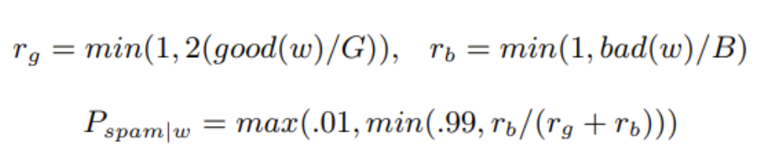
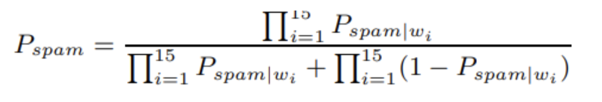

Chapitre 8

Je pense qu’il est possible d’arrêter le spam, et que les filtres basés
sur le contenu sont le moyen d’y parvenir. Le talon d’Achille des
spammeurs est leur message. Ils peuvent contourner toute autre barrière
que vous mettez en place. Ils l’ont fait jusqu’à présent, du moins. Mais
ils doivent transmettre leur message, quel qu’il soit. Si nous pouvons
écrire un logiciel qui reconnaît leurs messages, il n’y a aucun moyen
qu’ils puissent contourner cela \[1\].

Pour le destinataire, le spam est facilement reconnaissable. Si vous
embauchiez quelqu’un pour lire votre courrier et se débarassser du spam,
il aurait peu de mal à le faire. Combien devons-nous faire, à l’absence
d’IA, pour automatiser ce processus ?

Je pense que nous serons en mesure de résoudre le problème avec des
algorithmes assez simples. En fait, j’ai constaté que vous pouvez
filtrer le spam d’aujourd’hui de manière acceptable en n’utilisant rien
de plus qu’une combinaison bayésienne des probabilités de spam des mots
individuels. En utilisant un filtre bayésien légèrement modifié (comme
décrit ci-dessous), nous manquons maintenant moins de 5 pour 1000 spams,
avec 0 faux positifs.

L’approche statistique n’est généralement pas la première que les gens
essaient lorsqu’ils écrivent des filtres anti-spam. Le premier instinct
de la plupart des hackers est d’essayer d’écrire un logiciel qui
reconnaît les propriétés individuelles du spam. Vous regardez les spams
et vous pensez, le culot de ces gars d’essayer de m’envoyer du courrier
qui commence par “Cher ami” ou qui a une ligne d’objet qui est toute en
majuscules et se termine par huit points d’exclamation. Je peux filtrer
ces choses avec environ une ligne de code.

Et c’est ce que vous faites, et au début, cela fonctionne. Quelques
règles simples enlèveront une grosse partie de votre spam entrant. Le
fait de chercher le mot clic attrapera 79,7 % des e-mails dans mon
corpus de spam, avec seulement 1,2 % de faux positifs.

J’ai passé environ six mois à écrire des logiciels qui cherchaient des
fonctionnalités de spam individuelles avant d’essayer l’approche
statistique. Ce que j’ai trouvé, c’est que reconnaître que les derniers
pourcentages des spams sont devenus très difficiles, et qu’au fur et à
mesure que je rendais les filtres plus stricts, j’ai obtenu plus de faux
positifs.

Les faux positifs sont des e-mails innocents qui sont identifiés à tort
comme des spams. Pour la plupart des utilisateurs, le manque d’e-mails
légitimes est d’un ordre de grandeur pire que la réception de spam, de
sorte qu’un filtre qui donne de faux positifs est comme un remède contre
l’acné qui comporte un risque de mort pour le patient.

Plus un utilisateur reçoit de spam, moins il est susceptible de
remarquer un courrier innocent dans son dossier spam. Et étrangement,
plus vos filtres anti-spam sont bons, plus les faux positifs deviennent
dangereux, car lorsque les filtres sont vraiment bons, les utilisateurs
seront plus susceptibles d’ignorer tout ce qu’ils attrapent.

Je ne sais pas pourquoi j’ai évité d’essayer l’approche statistique
pendant si longtemps. Je pense que c’est parce que je suis devenu accro
à essayer d’identifier moi-même les fonctionnalités de spam, comme si je
jouais à une sorte de jeu compétitif avec les spammeurs. (Les
non-hackers ne s’en rendent pas souvent compte, mais la plupart des
hackers sont très compétitifs.) Lorsque j’ai essayé l’analyse
statistique, j’ai immédiatement constaté qu’elle était beaucoup plus
intelligente que je ne l’avais été. Il a découvert, bien sûr, que des
termes comme virtumundo et adolescents étaient de bons indicateurs de
spam. Mais il a également découvert que per et FL et ff0000 sont de bons
indicateurs de spam. En fait, ff0000 (HTML pour rouge vif) s’avère être
un aussi bon indicateur de spam que n’importe quel terme pornographique.

Voici un croquis de la façon dont je fais le filtrage statistique. Je
commence par un corpus de spam et un corpus de courriers non spam. Pour
le moment, chacun contient environ 4000 messages. Je scanne l’ensemble
du texte, y compris les en-têtes et le HTML et Javascript intégrés, de
chaque message dans chaque corpus. Je considère actuellement les
caractères alphanumériques, les tirets, les apostrophes et les signes de
dollar comme faisant partie des jetons, et tout le reste comme un
séparateur de jetons. (Il y a probablement place à l’amélioration ici.)
J’ignore les jetons qui sont tous des chiffres, et j’ignore également
les commentaires HTML, sans même les considérer comme des séparateurs de
jetons. Je compte le nombre de fois où chaque jeton (en ignorant le cas,
actuellement) se produit dans chaque corpus. À ce stade, je me retrouve
avec deux grandes tables de hachage, une pour chaque corpus, mappant les
jetons au nombre d’occurrences.

Ensuite, je crée une troisième table de hachage, cette fois en
cartographiant chaque jeton à la probabilité qu’un e-mail le contenant
soit un spam, Pspam\|w que je calcule comme suit :

<figure>

<figcaption aria-hidden="true">
Pspam\|w
</figcaption>
</figure>

Où w est le jeton dont nous calculons la probabilité, bon et mauvais
sont les tables de hachage que j’ai créées dans la première étape, et G
et B sont le nombre de messages non-spam et de spam respectivement.

Je veux biaiser légèrement les probabilités pour éviter les faux
positifs, et par essais et erreurs, j’ai constaté qu’une bonne façon de
le faire est de doubler tous les chiffres en bon état. Cela permet de
faire la distinction entre les mots qui apparaissent occasionnellement
dans les e-mails légitimes et les mots qui ne le font presque jamais. Je
ne considère que les mots qui se produisent plus de cinq fois au total
(en fait, en raison du doublement, se produire trois fois dans le
courrier non spam serait suffisant). Et puis il y a la question de la
probabilité à attribuer aux mots qui se trouvent dans un corpus mais pas
dans l’autre. Encore une fois, par essais et erreurs, j’ai choisi .01 et
.99. Il y a peut-être de la place pour l’accord ici, mais au fur et à
mesure que le corpus se développe, un tel accord se produira
automatiquement de toute façon.

Le plus observateur remarquera que bien, que je considère chaque corpus
comme un seul long flux de texte à des fins de comptage des occurrences,
j’utilise le nombre d’e-mails dans chacun, plutôt que leur longueur
combinée, comme diviseur dans le calcul des probabilités de spam. Cela
ajoute un autre léger biais pour se protéger contre les faux positifs.

Lorsque le nouveau courrier arrive, il est scanné en jetons, et les
quinze jetons les plus intéressants, ou l’intérêt est mesuré en fonction
de la distance qui sépare leur probabilité de spam d’une probabilité
neutre. 5, sont utilisés pour calculer la probabilité que le courrier
soit du spam. Si w1, . . . , w15 sont les quinze jetons les plus
intéressants, vous calculez la probabilité combinée de cette manière :

<figure>

<figcaption aria-hidden="true">
Probabilitée combinée
</figcaption>
</figure>

Une question qui se pose dans la pratique est la probabilité d’attribuer
à un mot que vous n’avez jamais vu, c’est-à-dire un mot qui n’apparaît
pas dans la table de hachage des probabilités de mots. J’ai constaté,
encore une fois par essais et erreurs, que .4 est un bon nombre à
utiliser. Si vous n’avez jamais vu un mot auparavant, il est
probablement assez innocent ; les mots de spam ont tendance à être trop
familiers.

Je traite le courrier comme du spam si l’algorithme ci-dessus lui donne
une probabilité de plus de .9 d’être du spam. Mais dans la pratique, peu
importe où je mets ce seuil, car peu de probabilités finissent au milieu
de la fourchette.

Un grand avantage de l’approche statistique est que vous n’avez pas
besoin de lire autant de spams. Au cours des six derniers mois, j’ai lu
littéralement des milliers de spams, et c’est vraiment un peu
démoralisant. Norbert Wiener a dit que si vous êtes en compétition avec
des esclaves, vous devenez un esclave, et il y a quelque chose de tout
aussi dégradant à rivaliser avec les spammeurs. Pour reconnaître les
caractéristiques individuelles du spam, vous devez essayer d’entrer dans
l’esprit du spammeur, et franchement, je veux passer le moins de temps
possible dans l’esprit des spammeurs.

Mais le véritable avantage de l’approche bayésienne, bien sûr, est que
vous savez ce que vous mesurez. Les filtres de reconnaissance des
fonctionnalités comme SpamAssassin attribuent un « score » de spam à
l’e-mail. L’approche bayésienne attribue une probabilité réelle. Le
problème avec un « score » est que personne ne sait ce que cela
signifie. L’utilisateur ne sait pas ce que cela signifie, mais pire
encore, le développeur du filtre non plus. Combien de points un e-mail
devrait-il recevoir pour avoir le mot sexe dedans ? Une probabilité peut
bien sûr être erronée, mais il y a peu d’ambiguïté sur ce qu’elle
signifie, ou sur la façon dont les preuves doivent être combinées pour
les calculer. Sur la base de mon corpus, sexe indique une probabilité de
.97 que l’e-mail contenant soit un spam, tandis que sexy indique .99 de
probabilité. Et la règle de Bayes, tout aussi sans ambiguïté, dit qu’un
e-mail contenant les deux mots, en l’absence (peu probable) de toute
autre preuve, aurait une chance de 99,97 % d’être un spam.

Parce qu’elle mesure les probabilités, l’approche bayésienne prend en
compte toutes les preuves dans l’e-mail, bonnes et mauvaises. Les mots
qui se produisent disproportionnellement rarement dans le spam (comme
bien que ou ce soir ou apparemment) contribuent autant à diminuer la
capacité du problème que les mauvais mots comme le désabonnement et
l’adhésion le font pour l’augmenter. Ainsi, un e-mail autrement innocent
qui inclut le mot sexe ne sera pas étiqueté comme spam.

Idéalement, bien sûr, les probabilités devraient être calculées de
manière individuelle pour chaque utilisateur. Je reçois beaucoup
d’e-mails contenant le mot Lisp, et (jusqu’à présent) aucun spam ne le
fait. Donc, un mot comme ça est en fait une sorte de mot de passe pour
m’envoyer du courrier. Dans mon précédent logiciel de filtrage du spam,
l’utilisateur pouvait configurer une liste de ces mots et le courrier
les contenant dépasserait automatiquement les filtres. Sur ma liste,
j’ai mis des mots comme Lisp et aussi mon code postal, afin que les
reçus (sinon plutôt spammeux) des commandes en ligne passent. Je pensais
être très intelligent, mais j’ai constaté que le filtre bayésien faisait
la même chose pour moi, et j’ai de plus découvert beaucoup de mots
auxquels je n’avais pas pensé.

Quand j’ai dit au début que nos filtres laissent passer moins de 5 spams
pour 1000 avec 0 faux positifs, je parle de filtrer mon courrier sur la
base d’un corpus de mon courrier. Mais ces chiffres ne sont pas
trompeurs, car c’est l’approche que je préconise : filtrer le courrier
de chaque utilisateur en fonction du spam et du courrier non-spam qu’il
reçoit. Essentiellement, chaque utilisateur devrait avoir deux boutons
de suppression, de suppression ordinaire et de suppression en tant que
spam. Tout ce qui est supprimé en tant que spam va dans le corpus de
spam, et tout le reste va dans le corpus de non-spam.

Vous pourriez démarrer les utilisateurs avec un filtre de semences, mais
en fin de compte, chaque utilisateur devrait avoir ses propres
probabilités par mot en fonction du courrier réel qu’il reçoit. Cela (a)
rend les filtres plus efficaces, (b) permet à chaque utilisateur de
décider de sa propre définition précise du spam, et (c) peut-être le
meilleur de tous, rend difficile pour les spammeurs d’accorder les mails
pour passer à travers les filtres. Si une grande partie du cerveau du
filtre se trouve dans les bases de données individuelles, alors il
suffit de régler les spams pour passer à travers les filtres à semences
ne garantissent rien sur la façon dont ils passeront à travers les
filtres variés et beaucoup plus entraînés des utilisateurs individuels.

Le filtrage du spam basé sur le contenu est souvent combiné à une liste
d’expéditeurs dont le courrier peut être accepté sans filtrage. Un moyen
facile de créer une telle liste blanche est de conserver une liste de
toutes les adresses auxquelles l’utilisateur a déjà envoyé du courrier.
Si un lecteur de courrier a un bouton de suppression en tant que spam,
vous pouvez également ajouter l’adresse de chaque email que
l’utilisateur a supprimé en tant que corbeille ordinaire.

Je suis un défenseur des listes blanches, mais plus comme un moyen
d’économiser le calcul, que comme un moyen d’améliorer le filtrage.
J’avais l’habitude de penser que les listes blanches faciliteraient le
filtrage, parce que vous n’auriez qu’à filtrer les e-mails de personnes
dont vous n’aviez jamais entendu parler, et quelqu’un qui vous envoie du
courrier pour la première fois est contraint par convention dans ce
qu’il peut vous dire. Quelqu’un que vous connaissez déjà pourrait vous
envoyer un e-mail parlant de sexe, mais quelqu’un qui vous envoie du
courrier pour la première fois ne serait pas susceptible de le faire. Le
problème est que les gens peuvent avoir plus d’une adresse e-mail, donc
une nouvelle adresse ne garantit pas que l’expéditeur vous écrit pour la
première fois. Il n’est pas rare qu’un vieil ami (surtout s’il s’agit
d’un hacker) vous envoie soudainement un e-mail avec une nouvelle
adresse, de sorte que vous ne pouvez pas risquer de faux positifs en
filtrant le courrier à partir d’adresses inconnues de manière
particulièrement stricte.

Dans un sens, cependant, mes filtres incarnent eux-mêmes une sorte de
liste blanche (et de liste noire) parce qu’ils sont basés sur des
messages entiers, y compris les en-têtes. Donc, dans cette mesure, ils «
connaissent » les adresses email des expéditeurs de confiance et même
les itinéraires par lesquels le courrier me parvient. Et ils savent la
même chose du spam, y compris les noms des serveurs, les versions de
courrier et les protocoles.

Si je pensais pouvoir maintenir les taux actuels de filtrage du spam, je
considérerais ce problème comme résolu. Mais cela ne signifie pas
grand-chose de pouvoir filtrer la plupart des spams actuels, car le spam
évolue. En effet, la plupart des techniques antispam jusqu’à présent ont
été comme des pesticides qui ne font rien d’autre que créer une nouvelle
souche résistante d’insectes.

J’ai plus d’espoir sur les filtres bayésiens, car ils évoluent avec le
spam. Ainsi, alors que les spammeurs commencent à utiliser v1agra au
lieu de viagra pour échapper aux filtres anti-spam simples d’esprit
basés sur des mots individuels, les filtres bayésiens le remarquent
automatiquement. En effet, v1agra est une preuve beaucoup plus
accablante que le viagra, et les filtres bayésiens savent exactement à
quel point.

Pourtant, quiconque propose un plan de filtrage du spam doit être en
mesure de répondre à la question : si les spammeurs savaient exactement
ce que vous faisiez, dans quelle mesure pourraient-ils vous dépasser ?
Par exemple, je pense que si le filtrage du spam basé sur la somme de
contrôle devient un obstacle sérieux, les spammeurs passeront simplement
aux techniques mad-lib pour générer des corps de messages.

Pour battre les filtres bayésiens, il ne suffirait pas aux spammeurs de
rendre leurs e-mails uniques ou d’arrêter d’utiliser des mots coquins
individuels. Ils auraient à faire en sorte que leurs courriers ne se
distinguent pas de votre courrier ordinaire. Et je pense que cela les
limiterait gravement. Le spam est principalement des argumentaires de
vente, donc à moins que votre courrier ordinaire ne soit entièrement un
argumentaire de vente, les spams auront inévitablement un caractère
différent. Et les spammeurs devraient aussi, bien sûr, changer (et
continuer à changer) toute leur infrastructure, parce que sinon les
en-têtes auraient l’air aussi mauvais pour les filtres bayésiens que
jamais, peu importe ce qu’ils ont fait au corps du message. Je n’en sais
pas assez sur l’infrastructure utilisée par les spammeurs pour savoir à
quel point il serait difficile de faire paraître les en-têtes innocents,
mais je suppose que ce serait encore plus difficile que de rendre le
message innocent.

En supposant qu’ils puissent résoudre le problème des en-têtes, le spam
du futur ressemblera probablement à ceci :

> Salut. Découvrez ce qui suit :  http://www.27meg.com/foo

Parce qu’il s’agit à peu près autant de pitch de vente que le filtrage
basé sur le contenu quittera la salle du spammeur à faire. (En effet, il
sera même difficile d’obtenir ces filtres passés, car si tout le reste
de l’e-mail est neutre, la probabilité de spam dépendra de l’URL, et il
faudra un certain effort pour que cela ait l’air neutre.)

Les spammeurs vont des entreprises qui gèrent des soi-disant listes
d’adhésion qui n’essaient même pas de dissimuler leur identité, aux gars
qui détournent les serveurs de messagerie pour envoyer des spams faisant
la promotion de sites pornographiques. Si nous utilisons le filtrage
pour réduire leurs options à des mails comme celui ci-dessus, cela
devrait à peu près mettre les spammeurs à l’extrémité “légitime” du
spectre hors d’activité ; ils se sentent obligés par diverses lois de
l’État d’inclure un modèle standard sur la raison pour laquelle leur
spam n’est pas du spam, et comment annuler votre “abonnement”, et ce
genre de message est facile à reconnaître.

(J’avais l’habitude de penser qu’il était naïf de croire que des lois
plus strictes réduiraient le spam. Maintenant, je pense que bien que des
lois plus strictes ne puissent pas réduire la quantité de spam que les
spammeurs envoient, elles peuvent certainement aider les filtres à
réduire la quantité de spam que les destinataires voient réellement.)

Tout au long du spectre, si vous limitez les arguments de vente que les
spammeurs peuvent faire, vous aurez inévitablement tendance à les mettre
hors d’affaire. Ce mot business est important à retenir. Les spammeurs
sont des hommes d’affaires. Ils envoient du spam parce que ça marche.
Cela fonctionne parce que bien que le taux de réponse soit
abominablement bas (au mieux 15 par million, contre 3000 par million
pour un envoi de catalogue), le coût, pour eux, n’est pratiquement rien.
Le coût est énorme pour les destinataires, environ 5 semaines-homme pour
chaque million de destinataires qui passent une seconde à supprimer le
spam, mais le spammeur n’a pas à payer cela. L’envoi de spam coûte
quelque chose au spammer cependant \[2\]. Ainsi, plus nous pouvons
obtenir le taux de réponse - que ce soit en filtrant ou en utilisant des
filtres pour forcer les spammeurs à diluer leurs présentations - moins
d’entreprises trouveront qu’il vaut la peine d’envoyer du spam.

La raison pour laquelle les spammeurs utilisent le genre d’argumentaires
de vente qu’ils utilisent est d’augmenter les taux de réponse. C’est
peut-être encore plus dégoûtant que d’entrer dans l’esprit d’un
spammeur, mais jetons un coup d’œil rapide à l’intérieur de l’esprit de
quelqu’un qui répond à un spam. Cette personne est soit étonnamment
crédule, soit profondément dans le déni de ses intérêts sexuels. Dans
les deux cas, aussi répugnant ou idiot que le spam nous semble, c’est
excitant pour eux. Les spammeurs ne diraient pas ces choses si elles ne
semblaient pas excitantes. Et “Checkez ce qui suit” ne va tout
simplement pas avoir presque l’attraction avec le destinataire du spam
comme le genre de choses que les spammeurs disent maintenant. Résultat :
s’il ne peut pas contenir des arguments de vente passionnants, le spam
devient moins efficace en tant que véhicule de marketing et moins
d’entreprises veulent l’utiliser.

C’est la grande victoire à la fin. J’ai commencé à écrire un logiciel de
filtrage du spam parce que je ne voulais plus avoir à regarder ce genre
de choses. Mais si nous sommes assez bons pour filtrer les spams, ils
cesseront de fonctionner, et les spammeurs cesseront enfin de les
envoyer.

De toutes les approches de la lutte contre le spam, du logiciel aux
lois, je crois que le filtrage bayésien sera le plus efficace. Mais je
pense aussi que plus nous entreprenons d’efforts antispam différents,
mieux c’est, car toute mesure qui limite les spammeurs aura tendance à
faciliter le filtrage. Et même dans le monde du filtrage basé sur le
contenu, je pense que ce serait une bonne chose s’il y a de nombreux
types de logiciels différents utilisés simultanément. Plus il y a de
filtres différents, plus il sera difficile pour les spammeurs d’accorder
les spams pour les traverser.
